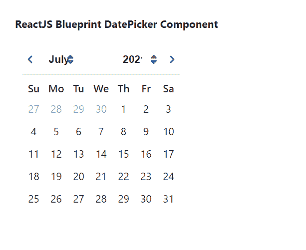

# 重新获取蓝图日期选择器组件

> 原文:[https://www . geesforgeks . org/reactjs-蓝图-日期选择器-组件/](https://www.geeksforgeeks.org/reactjs-blueprint-datepicker-component/)

是一个基于反应的网络用户界面工具包。该库非常适合构建桌面应用程序的复杂数据密集型界面，并且非常受欢迎。日期选择器组件帮助用户选择单一日期。我们可以在 reatjs 中使用以下方法来使用 reatjs 蓝图日期选择器组件。

**DatePicker Props:**

*   **canClearSelection:** 允许用户通过点击当前选择的日期来清除选择。
*   **类名:**用于表示传递给子元素的以空格分隔的类名列表。
*   **clearButtonText:** 用于表示动作栏中复位按钮的文本。
*   **daypickerrpops:**用于表示传递给 *ReactDayPicker* 的道具。
*   **默认值:**用于表示日历的第一天将显示为选中状态。
*   **highlightCurrentDay:** 表示日历中是否要突出显示当天。
*   **初始月:**用于表示日历显示的初始月份。
*   **地区:**用于表示地区名称。
*   **localeeutils:**用来表示提供国际化支持的函数集合。
*   **最大日期:**表示用户可以选择的最晚日期。
*   **minDate:** 用于表示用户可以选择的最早日期。
*   **修饰符:**它用于表示函数的集合，这些函数决定了哪些修饰符类应用于哪些天。
*   **onChange:** 是用户选择一天时触发的回调函数。
*   **onShortcutChange:** 是启用快捷键道具，用户更改快捷键时触发的回调函数。
*   **reverse emonthanyemunus:**如果设置为 true，月份菜单将出现在年份菜单的左侧。
*   **selectedShortcutIndex:** 用于表示当前选中的快捷方式。
*   **快捷方式:**表示是否显示快速选择日期的快捷方式。
*   **显示动作工具条:**用于指示底部显示*今日*和*清除*按钮是否显示。
*   **时间选择器:**用于进一步配置出现在日历下方的*时间选择器*。
*   **时间精度:**用于表示日历中时间选择的精度。
*   **today 按钮文本:**用于表示动作栏中“today”按钮的文本。
*   **值:**表示当前选择的日期。

**date pickersortcut props:**

*   **日期:**用于表示此快捷方式所代表的日期。
*   **includeTime:** 用于当此道具设置为 true 时，允许此快捷方式更改选定的时间和日期。
*   **标签:**用于表示列表中出现的快捷标签。

**创建反应应用程序并安装模块:**

**步骤 1:** 使用以下命令创建一个反应应用程序:

```
npx create-react-app foldername
```

**步骤 2:** 创建项目文件夹(即文件夹名**)后，使用以下命令移动到该文件夹中:**

```
cd foldername
```

**步骤 3:** 创建 ReactJS 应用程序后，使用以下命令安装所需的****模块:****

```
**npm install @blueprintjs/core
npm install @blueprintjs/datetime**
```

******项目结构:**如下图。****

****

项目结构**** 

******示例:**现在在 **App.js** 文件中写下以下代码。在这里，App 是我们编写代码的默认组件。****

## ****App.js****

```
**import React from 'react'
import '@blueprintjs/datetime/lib/css/blueprint-datetime.css';
import '@blueprintjs/core/lib/css/blueprint.css';
import { DatePicker } from "@blueprintjs/datetime";

function App() {
    return (
        <div style={{
            display: 'block', width: 400, padding: 30
        }}>
            <h4>ReactJS Blueprint DatePicker Component</h4>
            <DatePicker />
        </div >
    );
}

export default App;**
```

******运行应用程序的步骤:**从项目的根目录使用以下命令运行应用程序:****

```
**npm start**
```

******输出:**现在打开浏览器，转到***http://localhost:3000/***，会看到如下输出:****

********

******参考:**T2】https://blueprintjs.com/docs/#datetime/datepicker****