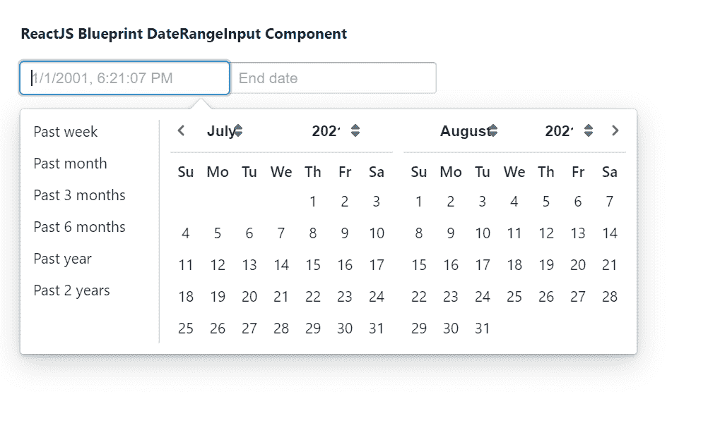

# 重新获取蓝图日期范围输入组件

> 原文:[https://www . geeksforgeeks . org/reactjs-蓝图-日期范围输入-组件/](https://www.geeksforgeeks.org/reactjs-blueprint-daterangeinput-component/)

是一个基于反应的网络用户界面工具包。该库非常适合构建桌面应用程序的复杂数据密集型界面，并且非常受欢迎。日期范围输入组件帮助用户输入日期范围。它用在用户必须输入日期范围的表单中。  我们可以在 reatjs 中使用以下方法来使用 reatjs 蓝图日期范围输入组件。

**DateRangeInput Props:**

*   **allowSingleDayRange:** 表示范围的开始日期和结束日期是否可以是同一天。
*   **类名:**用于表示传递给子元素的以空格分隔的类名列表。
*   **关闭选择:**用于指示当日期范围被完全选择时，日历弹出窗口是否应该关闭。
*   **contiguousCalendarMonths:**用于表示日历中显示的月份是否连续。
*   **daypickerrpops:**用于表示传递给 *ReactDayPicker* 的道具。
*   **默认值:**用于表示不受控制时组件中使用的默认日期范围。
*   **禁用:**用于指示文本输入是否非交互。
*   **endInputProps:** 用于表示传递给结束日期输入组的道具。
*   **formatDate:** 是一个将 JavaScript 日期渲染成字符串的函数。
*   **highlightCurrentDay:** 表示日历中是否要突出显示当天。
*   **初始月:**用于表示日历显示的初始月份。
*   **invalidDateMessage:** 用于表示所选日期无效时显示的错误信息。
*   **区域设置:**用于表示传递给 localeUtils 中函数的区域设置名称。
*   **localeeutils:**用来表示提供国际化支持的函数集合。
*   **最大日期:**表示用户可以选择的最晚日期。
*   **minDate:** 用于表示用户可以选择的最早日期。
*   **修饰符:**它用于表示函数的集合，这些函数决定了哪些修饰符类应用于哪些天。
*   **onChange:** 是用户选择一天时触发的回调函数。
*   **onError:** 是用户输入完新日期，日期导致错误状态时触发的功能。
*   **outOfRangeMessage:** 用于表示所选日期超出范围时显示的错误信息。
*   **重叠日期消息:**用于表示所选日期重叠时显示的错误消息。
*   **parseDate:** 是将用户输入文本反序列化为 JavaScript Date 对象的函数。
*   **占位符:**用于表示要在空输入字段中显示的占位符文本。
*   **popoverProps:** 用来表示要传给 popover 的道具。
*   **reverse emonthanyemunus:**如果设置为 true，月份菜单将出现在年份菜单的左侧。
*   **selectllonfoccus**:用于表示是否要对整个文本字段进行焦点选择。
*   **快捷方式:**用于指示是否显示快速选择日期范围的快捷方式。
*   **单月历:**表示是否只显示单月历。
*   **startinputrops:**用于表示传递给开始日期输入组的道具。
*   **时间选择器:**用于进一步配置出现在日历下方的*时间选择器*。
*   **时间精度:**用于表示日历中时间选择的精度。
*   **值:**表示当前选择的日期范围。

**创建反应应用程序并安装模块:**

*   **步骤 1:** 使用以下命令创建一个反应应用程序:

    ```jsx
    npx create-react-app foldername
    ```

*   **步骤 2:** 创建项目文件夹(即文件夹名**)后，使用以下命令移动到该文件夹中:**

    ```jsx
    cd foldername
    ```

*   **步骤 3:** 创建 ReactJS 应用程序后，使用以下命令安装所需的****模块:****

    ```jsx
    **npm install @blueprintjs/core
    npm install @blueprintjs/datetime**
    ```

******项目结构:**如下图。****

****

项目结构**** 

******示例:**现在在 **App.js** 文件中写下以下代码。在这里，App 是我们编写代码的默认组件。****

## ****App.js****

```jsx
**import React from 'react'
import '@blueprintjs/datetime/lib/css/blueprint-datetime.css';
import '@blueprintjs/core/lib/css/blueprint.css';
import { DateRangeInput } from "@blueprintjs/datetime";

function App() {
    return (
        <div style={{
            display: 'block', width: 400, padding: 30
        }}>
            <h4>ReactJS Blueprint DateRangeInput Component</h4>
            <DateRangeInput
                formatDate={date => date.toLocaleString()}
                parseDate={str => new Date(str)}
            />
        </div >
    );
}

export default App;**
```

******运行应用程序的步骤:**从项目的根目录使用以下命令运行应用程序:****

```jsx
**npm start**
```

******输出:**现在打开浏览器，转到***http://localhost:3000/***，会看到如下输出:****

********

******参考:**[https://blue printjs . com/docs/# datetime/daterange input](https://blueprintjs.com/docs/#datetime/daterangeinput)****