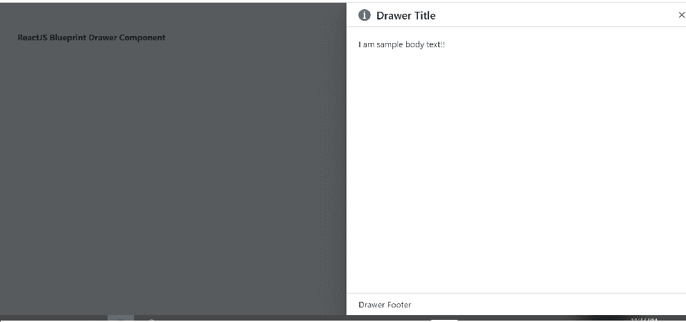

# 反应堆蓝图抽屉组件

> 原文:[https://www . geesforgeks . org/reactjs-蓝图-抽屉-组件/](https://www.geeksforgeeks.org/reactjs-blueprint-drawer-component/)

是一个基于反应的网络用户界面工具包。该库非常适合构建桌面应用程序的复杂数据密集型界面，并且非常受欢迎。

抽屉组件是从屏幕边缘滑入的面板。它将内容覆盖在用户界面的现有部分。我们可以在 reatjs 中使用以下方法来使用 reatjs 蓝图抽屉组件。

**抽屉道具:**

*   **自动对焦:**用于指示叠加首次打开时是否应获取应用焦点。
*   **backdropbclassname:**用于表示应用于背景元素的 CSS 类名。
*   **背景图:**用于表示背景元素的 HTML 道具。
*   **canEscapeKeyClose:** 用于指示按 esc 键是否应调用 *onClose* 。
*   **canoutsidekclose:**用于指示在覆盖元素外单击是否应该调用 *onClose* 。
*   **类名:**用于表示传递给子元素的以空格分隔的类名列表。
*   **enforceFocus:** 用于表示叠加是否要防止焦点自行离开。
*   **has background:**用于指示是否应该在内容后面呈现跨容器的 background 元素。
*   **图标:**用于表示要在抽屉标题中呈现的图标或图标元素的名称。
*   **isclosebuttonshowed:**用于指示是否在对话框的表头显示关闭按钮。
*   **isOpen:** 用来表示覆盖图及其子图的可见性。
*   **lazy:** 用于表示在首次打开覆盖时，如果设置为 true，并且 usePortal={true}，则创建包含子级的门户并将其附加到 DOM。
*   **onClose:** 用于表示用户交互导致叠加关闭时触发的回调功能，如点击叠加或按 esc 键。
*   **onClosed:** 它用于表示在 CSS close 转换结束之后，但在子元素从 DOM 中移除之前调用的生命周期方法。
*   **onClosing:** 它用于表示就在子对象上 CSS 关闭转换开始之前调用的生命周期方法。接收正在关闭的子级的 DOM 元素。
*   **onOpened:** 用来表示 CSS 开放转换结束后刚刚调用的生命周期方法。
*   **on open:**用于表示在 DOM 中挂载子元素之后，CSS 打开转换开始之前调用的生命周期方法。
*   **portalClassName:** 如果 usePortal={true}，则用于表示应用于 Portal 元素的以空格分隔的类名字符串。
*   **portalContainer:** 用于表示当 usePortal 为 true 时，覆盖将其内容呈现到其中的容器元素。
*   **位置:**用于抽屉的位置。
*   **shouldreturnfocusclose:**用于指示在此抽屉关闭后，应用程序是否应将焦点返回到文档中的最后一个活动元素。
*   **大小:**用来表示抽屉的 CSS 大小。
*   **样式:**用于表示应用于对话框的 CSS 样式。
*   **标题:**用于表示对话框的标题。
*   **过渡持续时间:**用于指示叠加的进入/离开过渡需要多长时间，以毫秒为单位。
*   **transitionName:** 用于表示内部 CSSTransition 的转换名称。
*   **使用门户:**用于指示覆盖图是否应该包装在门户中。
*   **垂直:**用于表示抽屉是否应该以垂直造型出现。

**创建反应应用程序并安装模块:**

*   **步骤 1:** 使用以下命令创建一个反应应用程序:

    ```
    npx create-react-app foldername
    ```

*   **步骤 2:** 在创建项目文件夹(即文件夹名**)后，使用以下命令将**移动到该文件夹:

    ```
    cd foldername
    ```

*   **步骤 3:** 创建 ReactJS 应用程序后，使用以下命令安装所需的****模块:

    ```
    npm install @blueprintjs/core
    ```**** 

******项目结构:**如下图。****

****

项目结构**** 

******示例:**现在在 **App.js** 文件中写下以下代码。在这里，App 是我们编写代码的默认组件。****

## ****App.js****

```
**import React from 'react'
import '@blueprintjs/core/lib/css/blueprint.css';
import { Drawer, Classes } from "@blueprintjs/core";

function App() {
    return (
        <div style={{
            display: 'block', width: 400, padding: 30
        }}>
            <h4>ReactJS Blueprint Drawer Component</h4>
            <Drawer
                isOpen={true}
                icon="info-sign"
                title="Drawer Title"
            >
                <div className={Classes.DRAWER_BODY}>
                    <div className={Classes.DIALOG_BODY}>
                        <p>I am sample body text!!</p>

                    </div>
                </div>
                <div className={Classes.DRAWER_FOOTER}>Drawer Footer</div>
            </Drawer>
        </div >
    );
}

export default App;**
```

******运行应用程序的步骤:**从项目的根目录使用以下命令运行应用程序:****

```
**npm start**
```

******输出:**现在打开浏览器，转到***http://localhost:3000/***，会看到如下输出:****

********

******参考:**T2】https://blueprintjs.com/docs/#core/components/drawer****