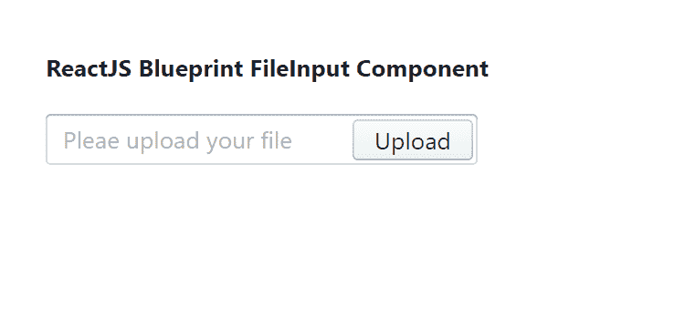

# 重新获取蓝图文件输入组件

> 原文:[https://www . geesforgeks . org/reactjs-蓝图-文件输入-组件/](https://www.geeksforgeeks.org/reactjs-blueprint-fileinput-component/)

是一个基于反应的网络用户界面工具包。该库非常适合构建桌面应用程序的复杂数据密集型界面，并且非常受欢迎。

文件输入组件为用户提供了一种将文件上传到我们的应用程序的方法。我们可以在 reatjs 中使用以下方法来使用 reatjs 蓝图文件输入组件。

**档案输入命题:**

*   **按钮文本:**用于表示按钮文本。
*   **禁用:**表示文件输入是否非交互。
*   **填充:**用于表示文件输入是否应占用其容器的整个宽度。
*   **hasSelection:** 表示用户是否在输入中做了选择。
*   **输入道具:**用于表示传递给子输入的道具。
*   **大:**用于表示输入的文件是否应该以大样式出现。
*   **onInputChange:** 是在<输入>变更事件时触发的回调函数。
*   **文本:**用于表示要显示的文本。

**创建反应应用程序并安装模块:**

*   **步骤 1:** 使用以下命令创建一个反应应用程序:

    ```jsx
    npx create-react-app foldername
    ```

*   **步骤 2:** 在创建项目文件夹(即文件夹名**)后，使用以下命令将**移动到该文件夹:

    ```jsx
    cd foldername
    ```

*   **步骤 3:** 创建 ReactJS 应用程序后，使用以下命令安装所需的****模块:****

    ```jsx
    **npm install @blueprintjs/core**
    ```

******项目结构:**如下图。****

****

项目结构**** 

******示例:**现在在 **App.js** 文件中写下以下代码。在这里，App 是我们编写代码的默认组件。****

## ****App.js****

```jsx
**import React from 'react'
import '@blueprintjs/core/lib/css/blueprint.css';
import { FileInput } from "@blueprintjs/core";

function App() {
    return (
        <div style={{
            display: 'block', width: 500, padding: 30
        }}>
            <h4>ReactJS Blueprint FileInput Component</h4>
            <FileInput text={'Pleae upload your file'} buttonText={'Upload'} />
        </div>
    );
}

export default App;**
```

******运行应用程序的步骤:**从项目的根目录使用以下命令运行应用程序:****

```jsx
**npm start**
```

******输出:**现在打开浏览器，转到***http://localhost:3000/***，会看到如下输出:****

********

******参考:**T2】https://blueprintjs.com/docs/#core/components/file-input****