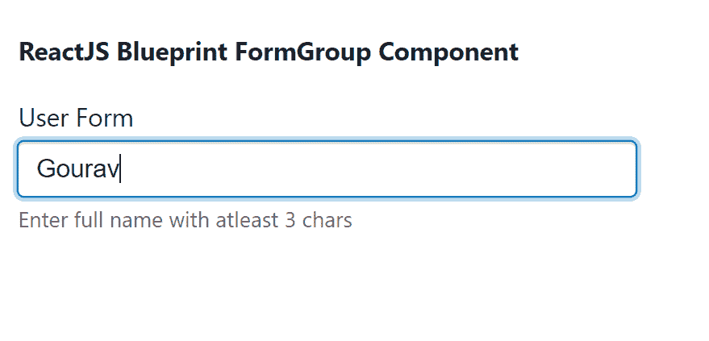
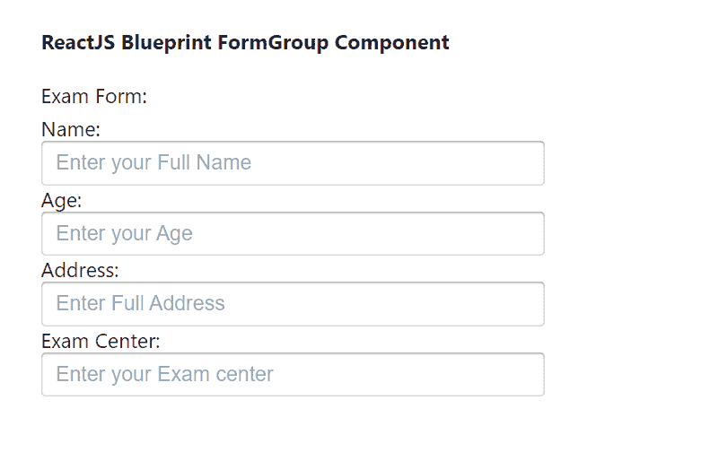

# 反应堆蓝图表单组组件

> 原文:[https://www . geeksforgeeks . org/reactjs-蓝图-formgroup-component/](https://www.geeksforgeeks.org/reactjs-blueprint-formgroup-component/)

是一个基于反应的网络用户界面工具包。该库非常适合构建桌面应用程序的复杂数据密集型界面，并且非常受欢迎。表单组组件为用户提供了一种方便地向表单添加一些结构的方法，因为该组件支持更复杂的表单控件。我们可以在 reatjs 中使用以下方法来使用 reatjs 蓝图表单组组件。

**表单组道具:**

*   **类名:**用于表示传递给子元素的以空格分隔的类名列表。
*   **contentClassName:** 用于表示要传递给类的以空格分隔的类名列表。包含子级的 FORM_CONTENT 元素。
*   **disabled:** 用于表示表单组是否应该显示为非交互。
*   **帮助文本:**用于表示可选的帮助文本。
*   **内联:**用于指示是否在一行上渲染标签和子对象。
*   **意图:**用于表示应用于元素的视觉意图颜色。
*   **标签:**用于表示该表单组的标签。
*   **标签符:**用于表示该表单组控制的可标签表单元素的标识属性。
*   **标签符:**用于表示标签后出现的可选副文本。
*   **样式:**用于表示应用于根元素的 CSS 属性。

**创建反应应用程序并安装模块:**

**步骤 1:** 使用以下命令创建一个反应应用程序:

```jsx
npx create-react-app foldername
```

**步骤 2:** 创建项目文件夹(即文件夹名**)后，使用以下命令移动到该文件夹中:**

```jsx
cd foldername
```

**步骤 3:** 创建 ReactJS 应用程序后，使用以下命令安装所需的****模块:****

```jsx
**npm install @blueprintjs/core**
```

******项目结构:**如下图。****

****

项目结构**** 

******示例 1:** 现在在 **App.js** 文件中写下以下代码。这里，我们演示了带有单个输入字段的 FromGroup 组件。****

## ****java 描述语言****

```jsx
**import React from 'react'
import '@blueprintjs/core/lib/css/blueprint.css';
import { FormGroup, InputGroup } from "@blueprintjs/core";

function App() {
    return (
        <div style={{
            display: 'block', width: 400, padding: 30
        }}>
            <h4>ReactJS Blueprint FormGroup Component</h4>
            <FormGroup
                helperText="Enter full name with atleast 3 chars"
                label="User Form"
                labelFor="text-input"
            >
                <InputGroup id="text-input" placeholder="Enter your username" />
            </FormGroup>
        </div >
    );
}

export default App;**
```

******运行应用程序的步骤:**从项目的根目录使用以下命令运行应用程序:****

```jsx
**npm start**
```

******输出:**现在打开浏览器，转到***http://localhost:3000/***，会看到如下输出:****

********

******示例 2:** 现在在 **App.js** 文件中写下以下代码。这里，我们已经演示了带有多个输入字段的 FromGroup 组件。****

## ****java 描述语言****

```jsx
**import React from 'react'
import '@blueprintjs/core/lib/css/blueprint.css';
import { FormGroup, InputGroup } from "@blueprintjs/core";

function App() {
    return (
        <div style={{
            display: 'block', width: 400, padding: 30
        }}>
            <h4>ReactJS Blueprint FormGroup Component</h4>
            <FormGroup
                label="Exam Form:"
                labelFor="text-input"
            >
                Name: <InputGroup placeholder="Enter your Full Name" />
                Age: <InputGroup placeholder="Enter your Age" />
                Address: <InputGroup placeholder="Enter Full Address" />
                Exam Center: <InputGroup placeholder="Enter your Exam center" />
            </FormGroup>
        </div >
    );
}

export default App;**
```

******运行应用程序的步骤:**从项目的根目录使用以下命令运行应用程序:****

```jsx
**npm start**
```

******输出:**现在打开浏览器，转到***http://localhost:3000/***，会看到如下输出:****

********

******参考:**T2】https://blueprintjs.com/docs/#core/components/form-group****