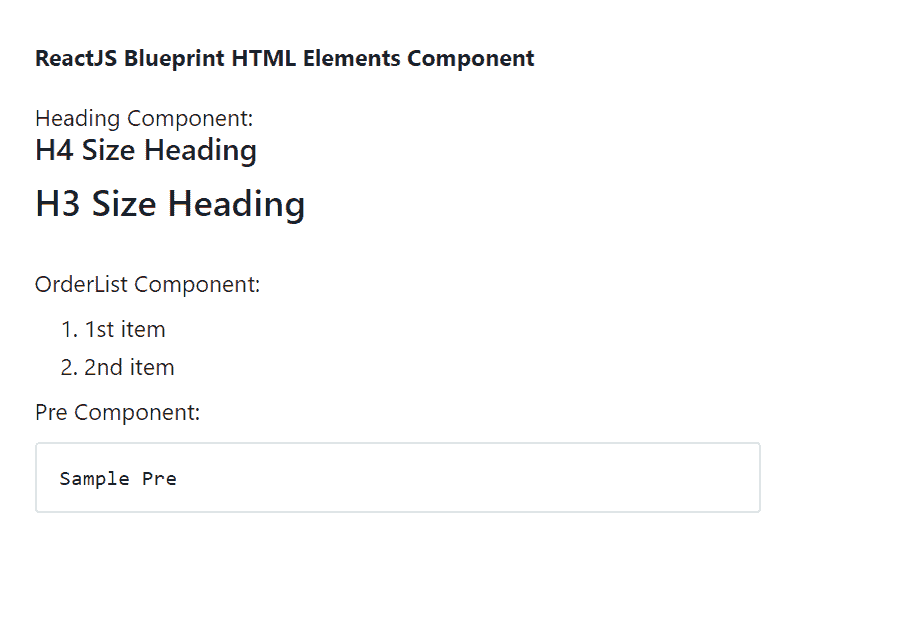

# 反应蓝图 HTML 元素组件

> 原文:[https://www . geeksforgeeks . org/reactjs-蓝图-html-elements-component/](https://www.geeksforgeeks.org/reactjs-blueprint-html-elements-component/)

是一个基于反应的网络用户界面工具包。该库非常适合构建桌面应用程序的复杂数据密集型界面，并且非常受欢迎。HTML 元素组件为用户提供了一种使用标题、段落等通用 HTML 元素的方式。我们可以在 ReactJS 中使用以下方法来使用 ReactJS 蓝图 HTML 元素组件。

**元素:**

*   **H1 到 H6:** 是 HTML 节标题组件。
*   **Blockquote:** 是 Blockquote 组件。
*   **代码:**是代码组件。
*   **标签:**是标签组件。
*   **Pre:** 是前置成分。
*   **OL:** 是有序列表组件。
*   **UL:** 是无序列表组件。
*   **HTMLTable:** 是表格组件。

**创建反应应用程序并安装模块:**

*   **步骤 1:** 使用以下命令创建一个反应应用程序:

    ```jsx
    npx create-react-app foldername
    ```

*   **步骤 2:** 创建项目文件夹(即文件夹名**)后，使用以下命令移动到该文件夹中:**

    ```jsx
    cd foldername
    ```

*   **步骤 3:** 创建 ReactJS 应用程序后，使用以下命令安装所需的****模块:****

    ```jsx
    **npm install @blueprintjs/core**
    ```

******项目结构:**如下图。****

****

项目结构**** 

******示例:**现在在 **App.js** 文件中写下以下代码。在这里，App 是我们编写代码的默认组件。****

## ****App.js****

```jsx
**import React from 'react'
import '@blueprintjs/core/lib/css/blueprint.css';
import { H3, H4, OL, Pre } from "@blueprintjs/core";

function App() {
    return (
        <div style={{
            display: 'block', width: 500, padding: 30
        }}>
            <h4>ReactJS Blueprint HTML Elements Component</h4>
            Heading Component:
            <H4>H4 Size Heading</H4>
            <H3>H3 Size Heading</H3> <br></br>

            OrderList Component:
            <OL>
                <li>1st item</li>
                <li>2nd item</li>
            </OL>

            Pre Component:
            <Pre>Sample Pre</Pre>
        </div >
    );
}

export default App;**
```

******运行应用程序的步骤:**从项目的根目录使用以下命令运行应用程序:****

```jsx
**npm start**
```

******输出:**现在打开浏览器，转到***http://localhost:3000/***，会看到如下输出:****

********

******参考:**T2】https://blueprintjs.com/docs/#core/components/html****