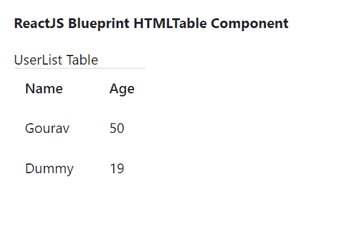

# 重新获取蓝图 html 表格组件

> 原文:[https://www . geesforgeks . org/reactjs-蓝图-htmltable-component/](https://www.geeksforgeeks.org/reactjs-blueprint-htmltable-component/)

是一个基于反应的网络用户界面工具包。该库非常适合构建桌面应用程序的复杂数据密集型界面，并且非常受欢迎。HTMLTable 组件为用户提供了一种添加修改器道具的方式，以将样式应用到 HTML <表格>元素中。我们可以在 reatjs 中使用以下方法来使用 reatjs 蓝图 HTMLTable 组件。

**HTMLTable Props:**

*   **加边框:**用于启用行与单元格之间的边框。
*   **浓缩:**用于小而浓缩的外观。
*   **elementRef:** 用于表示接收该组件呈现的原生 HTML 元素的引用处理程序或引用对象。
*   **交互式:**用于启用行上的悬停样式。
*   **小:**用于此元素和所有子元素的小而精简的外观。
*   **条纹:**用于奇数行的交替背景色。

**创建反应应用程序并安装模块:**

*   **步骤 1:** 使用以下命令创建一个反应应用程序:

    ```
    npx create-react-app foldername
    ```

*   **步骤 2:** 在创建项目文件夹(即文件夹名**)后，使用以下命令将**移动到该文件夹:

    ```
    cd foldername
    ```

*   **步骤 3:** 创建 ReactJS 应用程序后，使用以下命令安装所需的****模块:****

    ```
    **npm install @blueprintjs/core**
    ```

******项目结构:**如下图。****

****

项目结构**** 

******示例:**现在在 **App.js** 文件中写下以下代码。在这里，App 是我们编写代码的默认组件。****

## ****App.js****

```
**import React from 'react'
import '@blueprintjs/core/lib/css/blueprint.css';
import { HTMLTable } from "@blueprintjs/core";

function App() {
    return (
        <div style={{
            display: 'block', width: 500, padding: 30
        }}>
            <h4>ReactJS Blueprint HTMLTable Component</h4>
            <HTMLTable>
                <thead>UserList Table</thead>
                <tbody>
                    <tr>
                        <th>Name</th>
                        <th>Age</th>
                    </tr>
                    <tr>
                        <td>Gourav</td>
                        <td>50</td>
                    </tr>
                    <tr>
                        <td>Dummy</td>
                        <td>19</td>
                    </tr>
                </tbody>
            </HTMLTable>
        </div >
    );
}

export default App;**
```

******运行应用程序的步骤:**从项目的根目录使用以下命令运行应用程序:****

```
**npm start**
```

******输出:**现在打开浏览器，转到***http://localhost:3000/***，会看到如下输出:****

********

******参考:**T2】https://blueprintjs.com/docs/#core/components/html-table****