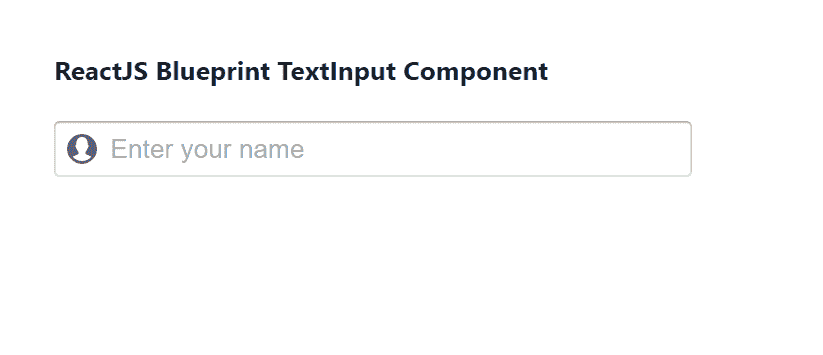

# 重新获取蓝图输入组组件

> 原文:[https://www . geesforgeks . org/reactjs-蓝图-输入组-组件/](https://www.geeksforgeeks.org/reactjs-blueprint-inputgroup-component/)

是一个基于反应的网络用户界面工具包。该库非常适合构建桌面应用程序的复杂数据密集型界面，并且非常受欢迎。

输入组组件为用户提供了一种向他们提供文本输入的方式。它是从用户那里收集数据的基本组件。我们可以在 reatjs 中使用以下方法来使用 reatjs 蓝图输入组组件。

**输入组道具:**

*   **异步控制:**当设置为真时，我们可以通过异步更新来控制该输入的值。
*   **类名:**用于表示传递给子元素的以空格分隔的类名列表。
*   **默认值:**用于表示输入的初始值，用于不受控制的使用。
*   **禁用:**用于指示输入是否非交互。
*   **填充:**用于指示部件是否应占据其容器的整个宽度。
*   **inputRef:** 用于表示接收支持该组件的 HTML <输入>元素的引用处理程序或引用对象。
*   **意图:**用于表示应用于元素的视觉意图颜色。
*   **大:**用于表示该输入是否应该使用大样式。
*   **leftElement:** 用于表示要在输入左侧渲染的元素。
*   **left con:**用于表示在用户光标前的输入组左侧要渲染的图标的名称。
*   **onChange:** 用于表示变更事件处理程序。
*   **占位符:**用于表示没有任何值时的占位符文本。
*   **右元素:**用于表示输入右侧要渲染的元素。
*   **round:** 用于指示输入(以及任何按钮)是否应该以圆头显示。
*   **小:**用于表示该输入是否应该使用小样式。
*   **类型:**用于表示 HTML 输入类型属性。
*   **值:**用于表示输入的形式值，用于受控使用。

**TextArea 命题:**

*   **类名:**用于表示传递给子元素的以空格分隔的类名列表。
*   **填充:**用于指示文本区域是否应占据其容器的整个宽度。
*   **垂直增长:**用于指示文本区域是否应自动垂直增长以容纳内容。
*   **inputRef:** 用于表示接收支持该组件的 HTML < textarea >元素的引用处理程序。
*   **意图:**用于表示应用于元素的视觉意图颜色。
*   **大:**用于表示文字区域是否应该以大样式出现。
*   **小:**用于指示文本区域是否应该以小样式出现。

**创建反应应用程序并安装模块:**

*   **步骤 1:** 使用以下命令创建一个反应应用程序:

    ```jsx
    npx create-react-app foldername
    ```

*   **步骤 2:** 创建项目文件夹(即文件夹名**)后，使用以下命令移动到该文件夹中:**

    ```jsx
    cd foldername
    ```

*   **步骤 3:** 创建 ReactJS 应用程序后，使用以下命令安装所需的****模块:****

    ```jsx
    **npm install @blueprintjs/core**
    ```

******项目结构:**如下图。****

****

项目结构**** 

******示例:**现在在 **App.js** 文件中写下以下代码。在这里，App 是我们编写代码的默认组件。****

## ****App.js****

```jsx
**import React from 'react'
import '@blueprintjs/core/lib/css/blueprint.css';
import { InputGroup } from "@blueprintjs/core";

function App() {
    return (
        <div style={{
            display: 'block', width: 400, padding: 30
        }}>
            <h4>ReactJS Blueprint TextInput Component</h4>
            <InputGroup
                disabled={false}
                leftIcon="user"
                onChange={() => { console.log("Called on change of value") }}
                placeholder="Enter your name"
            />
        </div >
    );
}

export default App;**
```

******运行应用程序的步骤:**从项目的根目录使用以下命令运行应用程序:****

```jsx
**npm start**
```

******输出:**现在打开浏览器，转到***http://localhost:3000/***，会看到如下输出:****

********

******参考:**T2】https://blueprintjs.com/docs/#core/components/text-inputs****