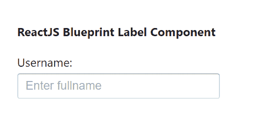
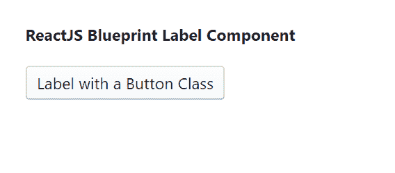

# 反应堆蓝图标签组件

> 原文:[https://www . geesforgeks . org/reactjs-蓝图-标签-组件/](https://www.geeksforgeeks.org/reactjs-blueprint-label-component/)

是一个基于反应的网络用户界面工具包。该库非常适合构建桌面应用程序的复杂数据密集型界面，并且非常受欢迎。标签组件为用户提供了一种增强表单可用性的方法。我们可以在 reatjs 中使用以下方法来使用 reatjs 蓝图标签组件。

**标签命题:**

*   **htmlFor:** 用于表示目标元素 ref 值。
*   **id:** 用于表示唯一标识符值。
*   **类:**用于表示造型的类名。

**创建反应应用程序并安装模块:**

**步骤 1:** 使用以下命令创建一个反应应用程序:

```jsx
npx create-react-app foldername
```

**步骤 2:** 创建项目文件夹(即文件夹名**)后，使用以下命令移动到该文件夹中:**

```jsx
cd foldername
```

**步骤 3:** 创建 ReactJS 应用程序后，使用以下命令安装所需的****模块:****

```jsx
**npm install @blueprintjs/core**
```

******项目结构:**如下图。****

****

项目结构**** 

******示例 1:** 演示标签组件，不应用任何道具。在 *App.js* 文件中写下以下代码。****

## ****java 描述语言****

```jsx
**import React from 'react'
import '@blueprintjs/core/lib/css/blueprint.css';
import { Label, InputGroup } from "@blueprintjs/core";

function App() {
    return (
        <div style={{
            display: 'block', width: 300, padding: 30
        }}>
            <h4>ReactJS Blueprint Label Component</h4>
            <Label>Username: 
            <InputGroup placeholder="Enter fullname"></InputGroup>
            </Label>
        </div>
    );
}

export default App;**
```

******运行应用程序的步骤:**从项目的根目录使用以下命令运行应用程序:****

```jsx
**npm start**
```

******输出:**现在打开浏览器，转到***http://localhost:3000/***，会看到如下输出:****

********

******示例 2:** 演示应用了类属性的标签组件。在 *App.js* 文件中写下以下代码。****

## ****java 描述语言****

```jsx
**import React from 'react'
import '@blueprintjs/core/lib/css/blueprint.css';
import { Label } from "@blueprintjs/core";

function App() {
    return (
        <div style={{
            display: 'block', width: 500, padding: 30
        }}>
            <h4>ReactJS Blueprint Label Component</h4>
            <Label class="bp3-button">Label with a Button Class</Label>
        </div>
    );
}

export default App;**
```

******运行应用程序的步骤:**从项目的根目录使用以下命令运行应用程序:****

```jsx
**npm start**
```

******输出:**现在打开浏览器，转到***http://localhost:3000/***，会看到如下输出:****

********

******参考:**T2】https://blueprintjs.com/docs/#core/components/label****