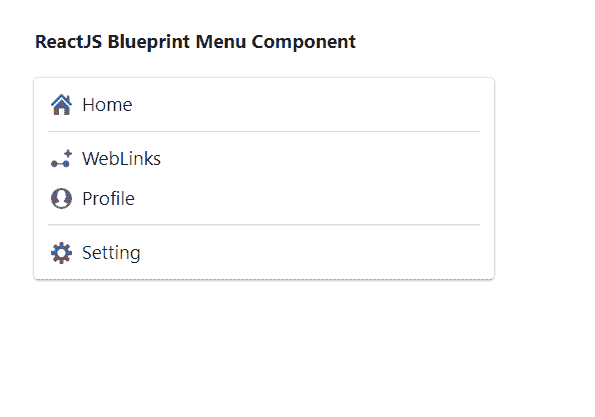

# 重新获取蓝图菜单组件

> 原文:[https://www . geesforgeks . org/reactjs-蓝图-菜单-组件/](https://www.geeksforgeeks.org/reactjs-blueprint-menu-component/)

是一个基于反应的网络用户界面工具包。该库非常适合构建桌面应用程序的复杂数据密集型界面，并且非常受欢迎。菜单组件为用户提供了一种方式显示交互项目列表。  我们可以在 reatjs 中使用以下方法来使用 reatjs 蓝图菜单组件。

**命题菜单:**

*   **类名:**用于表示传递给子元素的以空格分隔的类名列表。
*   **大:**用于表示该菜单中的菜单项是否应该使用大的外观。
*   **ulRef:** 用于表示接收支持该组件的 HTML < ul >元素的 Ref 处理程序。

**MenuItem Props:**

*   **激活:**用于指示该菜单项是否以激活状态出现。
*   **子级:**用于表示该组件的子级将呈现在子菜单中。
*   **类名:**用于表示传递给子元素的以空格分隔的类名列表。
*   **禁用:**用于指示该菜单项是否非交互。
*   **href:** 用于表示链接 URL。
*   **htmlTitle:** 用于表示要传递给组件的 HTML 标题
*   **图标:**用于表示文本前要渲染的图标名称或图标元素。
*   **意图:**用于表示应用于元素的视觉意图颜色。
*   **标签:**用于右对齐标签文本内容，用于显示热键。
*   **labelClassName:** 它用于表示一个用空格分隔的类名列表，该列表将传递给右对齐的标签包装元素。
*   **标签元素:**用于右对齐标签内容，用于显示热键。
*   **多行:**用于表示是否允许文本换行到多行。
*   **onClick:** 用于表示点击事件处理程序。
*   **popoverProps:** 用来表示要扩散到 Popover 的道具。
*   **shouldismisPopover:**用于表示没有子菜单的已启用项目，点击时是否自动关闭其父 popover。
*   **标记名:**用于表示包装菜单项的 HTML 标记的名称。
*   **目标:**用于表示链接目标属性。
*   **文本:**用于表示项目文本，可用性所需。
*   **textClassName:** 它用于表示要传递给文本包装元素的以空格分隔的类名列表。

**菜单分割命题:**

*   **儿童:**该组件不支持儿童。
*   **类名:**用于表示传递给子元素的以空格分隔的类名列表。
*   **标题:**用于表示可选表头标题。

**创建反应应用程序并安装模块:**

*   **步骤 1:** 使用以下命令创建一个反应应用程序:

    ```
    npx create-react-app foldername
    ```

*   **步骤 2:** 在创建项目文件夹(即文件夹名**)后，使用以下命令将**移动到该文件夹:

    ```
    cd foldername
    ```

*   **步骤 3:** 创建 ReactJS 应用程序后，使用以下命令安装所需的****模块:****

    ```
    **npm install @blueprintjs/core**
    ```

******项目结构:**如下图。****

****

项目结构**** 

******示例:**现在在 **App.js** 文件中写下以下代码。在这里，App 是我们编写代码的默认组件。****

## ****App.js****

```
**import React from 'react'
import '@blueprintjs/core/lib/css/blueprint.css';
import { Menu, Classes, MenuItem, MenuDivider, Icon } from "@blueprintjs/core";

function App() {
    return (
        <div style={{
            display: 'block', width: 400, padding: 30
        }}>
            <h4>ReactJS Blueprint Menu Component</h4>
            <Menu className={Classes.ELEVATION_1}>
                <MenuItem icon={<Icon icon="home" />} text="Home" />
                <MenuDivider />
                <MenuItem icon="new-link" text="WebLinks" />
                <MenuItem icon="user" text="Profile" />
                <MenuDivider />
                <MenuItem icon="cog" text="Setting" />
            </Menu>
        </div >
    );
}

export default App;**
```

******运行应用程序的步骤:**从项目的根目录使用以下命令运行应用程序:****

```
**npm start**
```

******输出:**现在打开浏览器，转到***http://localhost:3000/***，会看到如下输出:****

********

******参考:**T2】https://blueprintjs.com/docs/#core/components/menu****