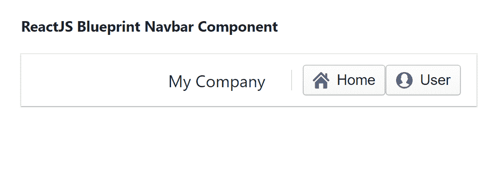

# 反应堆蓝图导航条组件

> 原文:[https://www . geeksforgeeks . org/reactjs-蓝图-nav bar-组件/](https://www.geeksforgeeks.org/reactjs-blueprint-navbar-component/)

是一个基于反应的网络用户界面工具包。该库非常适合构建桌面应用程序的复杂数据密集型界面，并且非常受欢迎。导航栏组件为用户提供了一种在应用程序顶部为他们提供导航控件的方式。我们可以在 ReactJS 中使用以下方法来使用 ReactJS 蓝图导航栏组件。

**Navbar Props:**

*   **类名:**用于表示传递给子元素的以空格分隔的类名列表。
*   **fixedTop:** 用于表示这个导航条是否应该固定在视口顶部。

**船级组推进剂:**

*   **align:** 用于表示组应该出现在导航栏的哪一侧。
*   **类名:**用于表示传递给子元素的以空格分隔的类名列表。

**导航条标题道具:**

*   **类名:**用于表示传递给子元素的以空格分隔的类名列表。

**navbar vider props:**

*   **类名:**用于表示传递给子元素的以空格分隔的类名列表。

**创建反应应用程序并安装模块:**

*   **步骤 1:** 使用以下命令创建一个反应应用程序:

    ```jsx
    npx create-react-app foldername
    ```

*   **步骤 2:** 在创建项目文件夹(即文件夹名**)后，使用以下命令将**移动到该文件夹:

    ```jsx
    cd foldername
    ```

*   **步骤 3:** 创建 ReactJS 应用程序后，使用以下命令安装所需的****模块:****

    ```jsx
    **npm install @blueprintjs/core**
    ```

******项目结构:**如下图。****

****

项目结构**** 

******示例:**现在在 **App.js** 文件中写下以下代码。在这里，App 是我们编写代码的默认组件。****

## ****App.js****

```jsx
**import React from 'react'
import '@blueprintjs/core/lib/css/blueprint.css';
import {
    Navbar, NavbarHeading, NavbarGroup,
    NavbarDivider, Button
} from "@blueprintjs/core";

function App() {

    return (
        <div style={{
            display: 'block', width: 500, padding: 30
        }}>
            <h4>ReactJS Blueprint Navbar Component</h4>
            <Navbar>
                <NavbarGroup align={'right'}>
                    <NavbarHeading>My Company</NavbarHeading>
                    <NavbarDivider />
                    <Button icon="home" text="Home" />
                    <Button icon="user" text="User" />
                </NavbarGroup>
            </Navbar>
        </div>
    );
}

export default App;**
```

******运行应用程序的步骤:**从项目的根目录使用以下命令运行应用程序:****

```jsx
**npm start**
```

******输出:**现在打开浏览器，转到***http://localhost:3000/***，会看到如下输出:****

********

******参考:**T2】https://blueprintjs.com/docs/#core/components/navbar****