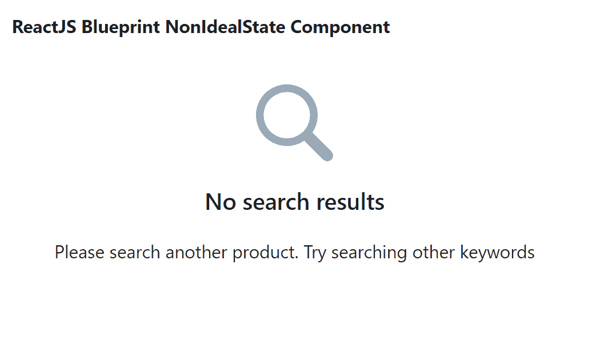

# 反应堆蓝图非理想状态组件

> 原文:[https://www . geeksforgeeks . org/reactjs-蓝图-非理想状态-组件/](https://www.geeksforgeeks.org/reactjs-blueprint-nonidealstate-component/)

是一个基于反应的网络用户界面工具包。该库非常适合构建桌面应用程序的复杂数据密集型界面，并且非常受欢迎。非理想状态组件为用户提供了一种方式通知用户某些内容不可用。我们可以在 reatjs 中使用以下方法来使用 reatjs 蓝图非理想状态组件。

非理想状态命题:

*   **动作:**表示解决描述后出现的非理想状态的动作。
*   **children:** 用于将 children 组件传递给底层元素。
*   **类名:**用于表示传递给子元素的以空格分隔的类名列表。
*   **描述:**用于表示对非理想状态的较长描述。
*   **图标:**用于表示要在文本前渲染的蓝图 UI 图标(或图标元素)的名称。
*   **标题:**用于表示非理想状态的标题。

**创建反应应用程序并安装模块:**

*   **步骤 1:** 使用以下命令创建一个反应应用程序:

    ```
    npx create-react-app foldername
    ```

*   **步骤 2:** 创建项目文件夹(即文件夹名**)后，使用以下命令移动到该文件夹中:**

    ```
    cd foldername
    ```

*   **步骤 3:** 创建 ReactJS 应用程序后，使用以下命令安装所需的****模块:****

    ```
    **npm install @blueprintjs/core**
    ```

******项目结构:**如下图。****

****

项目结构**** 

******示例:**现在在 **App.js** 文件中写下以下代码。在这里，App 是我们编写代码的默认组件。****

## ****App.js****

```
**import React from 'react'
import '@blueprintjs/core/lib/css/blueprint.css';
import { NonIdealState } from "@blueprintjs/core";

function App() {

    return (
        <div style={{
            display: 'block', width: 500, padding: 30
        }}>
            <h4>ReactJS Blueprint NonIdealState Component</h4>
            <NonIdealState
                icon={"search"}
                title="No search results"
                description='Please search another product. 
                Try searching other keywords'
            />
        </div>
    );
}

export default App;**
```

******运行应用程序的步骤:**从项目的根目录使用以下命令运行应用程序:****

```
**npm start**
```

******输出:**现在打开浏览器，转到***http://localhost:3000/***，会看到如下输出:****

********

******参考:**[https://bluepointjs . com/docs/# core/components/非理想状态](https://blueprintjs.com/docs/#core/components/non-ideal-state)****