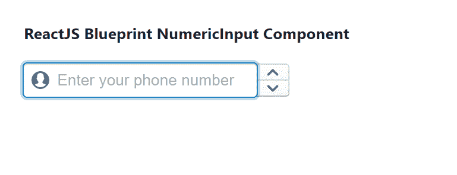

# 重新获取蓝图编号输入组件

> 原文:[https://www . geesforgeks . org/reactjs-蓝图-数字输入-组件/](https://www.geeksforgeeks.org/reactjs-blueprint-numberinput-component/)

是一个基于反应的网络用户界面工具包。该库非常适合构建桌面应用程序的复杂数据密集型界面，并且非常受欢迎。

NumberInput 组件为用户提供了一种为他们提供数字输入的方式。它是从用户那里收集数字数据的基本组件。我们可以在 reatjs 中使用以下方法来使用 reatjs 蓝图编号输入组件。

**number put props:**

*   **allownumericcharacters only:**字段中是否只允许浮点数字符。
*   **异步控制:**当设置为真时，我们可以通过异步更新来控制该输入的值。
*   **按钮位置:**用于表示按钮相对于输入字段的位置。
*   **箝位值 on bull:**用于指示模糊时是否应将值箝位到[min，max]。
*   **类名:**用于表示传递给子元素的以空格分隔的类名列表。
*   **默认值:**用于表示输入的初始值，用于不受控制的使用。
*   **禁用:**用于指示输入是否非交互。
*   **填充:**用于指示部件是否应占据其容器的整个宽度。
*   **inputRef:** 用于表示接收支持该组件的 HTML <输入>元素的引用处理程序或引用对象。
*   **意图:**用于表示应用于元素的视觉意图颜色。
*   **大:**用于表示该输入是否应该使用大样式。
*   **left con:**用于表示要在输入左侧呈现的图标或图标元素的名称。
*   **区域设置:**用于表示区域设置名称，该名称被传递给组件以格式化数字，并允许在特定的区域设置中键入数字。
*   **主步长:**用于表示换档时连续值之间的增量。
*   **max:** 用于表示输入的最大值。
*   **min:** 用于表示输入的最小值。
*   **minorStepSize:** 用于表示按住 alt 时连续值之间的增量。
*   **onButtonClick:** 是一个回调函数，当值因按钮点击而改变时触发。
*   **onValueChange:** 它是一个回调函数，当值因键入、箭头键或按钮点击而改变时触发。
*   **占位符:**用于表示没有任何值时的占位符文本。
*   **右元素:**用于表示要在输入右侧呈现的元素。
*   **selectAllOnFocus:** 用于表示是否要选择整个文本字段进行聚焦。
*   **selectllonintement:**用于指示是否递增选择整个文本字段。
*   **步长:**用于表示无修饰键时连续值之间的增量。
*   **值:**用于表示要在输入字段中显示的值。

**创建反应应用程序并安装模块:**

*   **步骤 1:** 使用以下命令创建一个反应应用程序:

    ```jsx
    npx create-react-app foldername
    ```

*   **步骤 2:** 在创建项目文件夹(即文件夹名**)后，使用以下命令将**移动到该文件夹:

    ```jsx
    cd foldername
    ```

*   **步骤 3:** 创建 ReactJS 应用程序后，使用以下命令安装所需的****模块:****

    ```jsx
    **npm install @blueprintjs/core**
    ```

******项目结构:**如下图。****

****

项目结构**** 

******示例:**现在在 **App.js** 文件中写下以下代码。在这里，App 是我们编写代码的默认组件。****

## ****App.js****

```jsx
**import React from 'react'
import '@blueprintjs/core/lib/css/blueprint.css';
import { NumericInput } from "@blueprintjs/core";

function App() {
    return (
        <div style={{
            display: 'block', width: 400, padding: 30
        }}>
            <h4>ReactJS Blueprint NumericInput Component</h4>
            <NumericInput
                disabled={false}
                leftIcon="user"
                onChange={() => { console.log("Called on change of value") }}
                placeholder="Enter your phone number"
            />
        </div >
    );
}

export default App;**
```

******运行应用程序的步骤:**从项目的根目录使用以下命令运行应用程序:****

```jsx
**npm start**
```

******输出:**现在打开浏览器，转到***http://localhost:3000/***，会看到如下输出:****

********

******参考:**T2】https://blueprintjs.com/docs/#core/components/numeric-input****