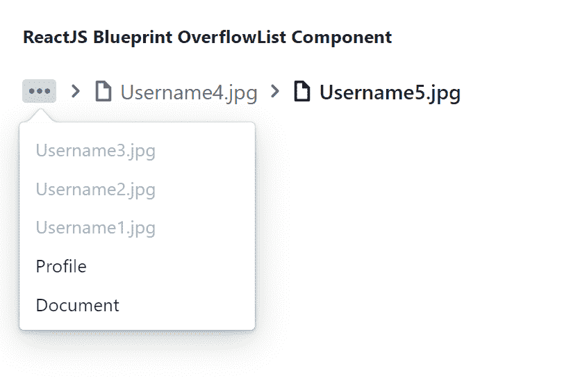

# 反应堆蓝图飞越列表组件

> 原文:[https://www . geeksforgeeks . org/reactjs-蓝图-overflowlist-component/](https://www.geeksforgeeks.org/reactjs-blueprint-overflowlist-component/)

是一个基于反应的网络用户界面工具包。该库非常适合构建桌面应用程序的复杂数据密集型界面，并且非常受欢迎。OverflowList 组件为用户提供了一种方法，让用户接受通用项目列表，然后它会尽可能多地渲染其内部的项目。我们可以在 ReactJS 中使用以下方法来使用 ReactJS 蓝图溢出列表组件。

**飞越列表道具:**

*   **alwaysRenderOverflow:** 用于指示是否强制总是调用 overflowRenderer，即使溢出的项目为零。
*   **类名:**用于表示传递给子元素的以空格分隔的类名列表。
*   **折叠从:**它用于表示项目应该从哪个方向折叠，即子项目的开始或结束。
*   **项:**用于传递项，列表中显示所有项，容器中放不下的项将改为在溢出中渲染。
*   **minVisibleItems:** 用于表示无论 DOM 维度如何，都不应折叠到溢出菜单中的可见项的最小数量。
*   **observeParents:** 如果设置为 true，也将观察容器的所有父 DOM 元素。
*   **onOverflow:** 是溢出项发生变化时触发的回调函数。
*   **overflowRenderer:** 它是一个回调函数，被触发来呈现溢出的项目。
*   **样式:**用于表示应用于根元素的 CSS 属性。
*   **标记名:**用于表示容器元素的 HTML 标记名。
*   **visibleitementrenderer:**是一个回调函数，被触发来渲染每个可见的项目。

**创建反应应用程序并安装模块:**

*   **步骤 1:** 使用以下命令创建一个反应应用程序:

    ```
    npx create-react-app foldername
    ```

*   **步骤 2:** 创建项目文件夹(即文件夹名**)后，使用以下命令移动到该文件夹中:**

    ```
    cd foldername
    ```

*   **步骤 3:** 创建 ReactJS 应用程序后，使用以下命令安装所需的****模块:****

    ```
    **npm install @blueprintjs/core**
    ```

******项目结构:**如下图。****

****

项目结构**** 

******示例:**现在在 **App.js** 文件中写下以下代码。在这里，App 是我们编写代码的默认组件。****

## ****App.js****

```
**import React from 'react'
import '@blueprintjs/core/lib/css/blueprint.css';
import { Breadcrumbs as OverflowList } from "@blueprintjs/core";

function App() {

    // Sample OverflowList items
    const sampleItems = [
        { href: "/document", icon: "folder-close", text: "Document" },
        { href: "/document/profile", icon: "user", text: "Profile" },
        { icon: "document", text: "Username1.jpg" },
        { icon: "document", text: "Username2.jpg" },
        { icon: "document", text: "Username3.jpg" },
        { icon: "document", text: "Username4.jpg" },
        { icon: "document", text: "Username5.jpg" },
    ];

    return (
        <div style={{
            display: 'block', width: 400, padding: 30
        }}>
            <h4>ReactJS Blueprint OverflowList Component</h4>
            <OverflowList
                items={sampleItems}
                overflowListProps={false}
            />
        </div >
    );
}

export default App;**
```

******运行应用程序的步骤:**从项目的根目录使用以下命令运行应用程序:****

```
**npm start**
```

******输出:**现在打开浏览器，转到***http://localhost:3000/***，会看到如下输出:****

********

******参考:**T2】https://blueprintjs.com/docs/#core/components/overflow-list****