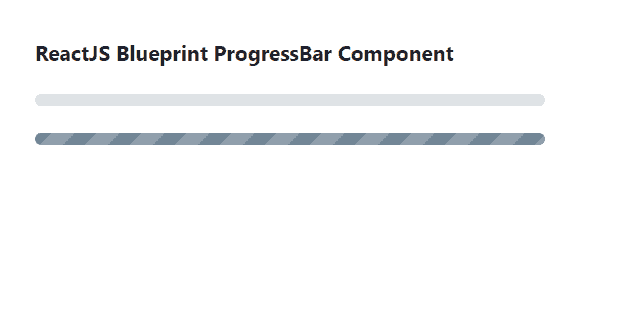

# 反应堆蓝图进度栏组件

> 原文:[https://www . geeksforgeeks . org/reactjs-蓝图-progressbar-component/](https://www.geeksforgeeks.org/reactjs-blueprint-progressbar-component/)

是一个基于反应的网络用户界面工具包。该库非常适合构建桌面应用程序的复杂数据密集型界面，并且非常受欢迎。 ProgressBar 组件以进度条的形式向用户显示任何任务/活动的进度。我们可以在 ReactJS 中使用以下方法来使用 ReactJS 蓝图进度栏组件。

**ProgressBar Props:**

*   **动画:**用于表示背景是否要动画。
*   **类名:**用于表示传递给子元素的以空格分隔的类名列表。
*   **意图:**用于表示应用于元素的视觉意图颜色。
*   **条纹:**用于表示背景是否要条纹。
*   **值:**用于表示 0 到 1(包括 0 和 1)之间的值，表示操作的进度。

**创建反应应用程序并安装模块:**

*   **步骤 1:** 使用以下命令创建一个反应应用程序:

    ```jsx
    npx create-react-app foldername
    ```

*   **步骤 2:** 创建项目文件夹(即文件夹名**)后，使用以下命令移动到该文件夹中:**

    ```jsx
    cd foldername
    ```

*   **步骤 3:** 创建 ReactJS 应用程序后，使用以下命令安装所需的****模块:****

    ```jsx
    **npm install @blueprintjs/core**
    ```

******项目结构:**如下图。****

****

项目结构**** 

******示例:**现在在 **App.js** 文件中写下以下代码。在这里，App 是我们编写代码的默认组件。****

## ****App.js****

```jsx
**import React from 'react'
import '@blueprintjs/core/lib/css/blueprint.css';
import { ProgressBar } from "@blueprintjs/core";

function App() {
    return (
        <div style={{
            display: 'block', width: 400, padding: 30
        }}>
            <h4>ReactJS Blueprint ProgressBar Component</h4>
            <ProgressBar value={0} />    <br></br>
            <ProgressBar value={1} /> 
        </div >
    );
}

export default App;**
```

******运行应用程序的步骤:**从项目的根目录使用以下命令运行应用程序:****

```jsx
**npm start**
```

******输出:**现在打开浏览器，转到***http://localhost:3000/***，会看到如下输出:****

********

******参考:**T2】https://blueprintjs.com/docs/#core/components/progress-bar****