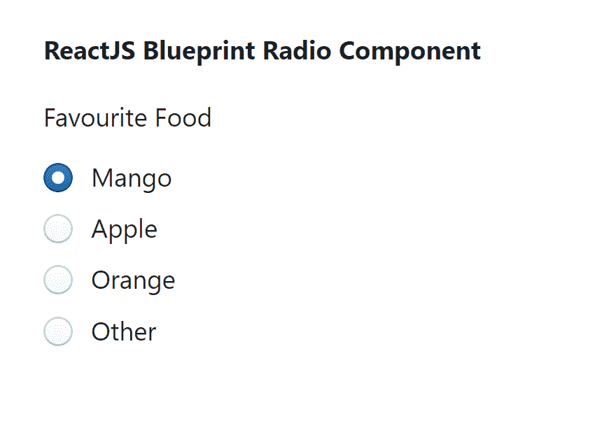

# 反应堆蓝图无线电组件

> 原文:[https://www . geesforgeks . org/reactjs-蓝图-无线电-组件/](https://www.geeksforgeeks.org/reactjs-blueprint-radio-component/)

是一个基于反应的网络用户界面工具包。该库非常适合构建桌面应用程序的复杂数据密集型界面，并且非常受欢迎。

无线电组件允许用户允许用户从一组中选择一个选项。我们可以在 ReactJS 中使用以下方法来使用 ReactJS 蓝图无线电组件。

**RadioGroup 道具:**

*   **类名:**用于表示传递给子元素的以空格分隔的类名列表。
*   **禁用:**用于指示该组及其所有无线电设备是否禁用。
*   **内联:**用于指示单选按钮是否水平内联显示。
*   **标签:**用于表示单选按钮上方显示的可选标签文本。
*   **名称:**用来表示团体的名称。
*   **onChange:** 是当前选中的电台发生变化时触发的回叫功能。
*   **选项:**用于表示组中要渲染的选项数组。
*   **selectedValue:** 用于表示所选电台的值。

**选项道具:**

*   **类名:**用于表示传递给子元素的以空格分隔的类名列表。
*   **禁用:**表示选项是否禁用。
*   **标签:**用于表示该选项的可选标签。
*   **值:**用于表示该选项的值。

**创建反应应用程序并安装模块:**

*   **步骤 1:** 使用以下命令创建一个反应应用程序:

    ```jsx
    npx create-react-app foldername
    ```

*   **步骤 2:** 创建项目文件夹(即文件夹名**)后，使用以下命令移动到该文件夹中:**

    ```jsx
    cd foldername
    ```

*   **步骤 3:** 创建 ReactJS 应用程序后，使用以下命令安装所需的****模块:****

    ```jsx
    **npm install @blueprintjs/core**
    ```

******项目结构:**如下图。****

****

项目结构**** 

******示例:**现在在 **App.js** 文件中写下以下代码。在这里，App 是我们编写代码的默认组件。****

## ****App.js****

```jsx
**import React from 'react'
import '@blueprintjs/core/lib/css/blueprint.css';
import { RadioGroup, Radio } from "@blueprintjs/core";

function App() {

    return (
        <div style={{
            display: 'block', width: 500, padding: 30
        }}>
            <h4>ReactJS Blueprint Radio Component</h4>
            <RadioGroup
                label="Favourite Food"
                selectedValue={'Mongo'}
            >
                <Radio label="Mango" value="Mongo" />
                <Radio label="Apple" value="Apple" />
                <Radio label="Orange" value="Orange" />
                <Radio label="Other" value="Other" />
            </RadioGroup>
        </div>
    );
}

export default App;**
```

******运行应用程序的步骤:**从项目的根目录使用以下命令运行应用程序:****

```jsx
**npm start**
```

******输出:**现在打开浏览器，转到***http://localhost:3000/***，会看到如下输出:****

********

******参考:**T2】https://blueprintjs.com/docs/#core/components/radio****