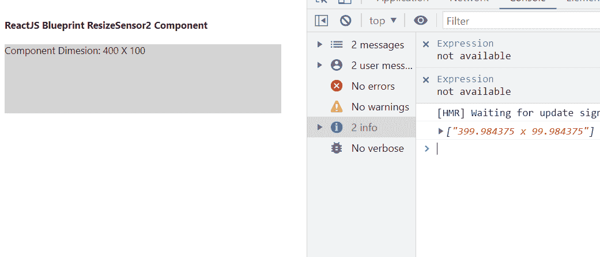

# 反应蓝图尺寸传感器 2 组件

> 原文:[https://www . geesforgeks . org/reactjs-蓝图-resize sensor 2-组件/](https://www.geeksforgeeks.org/reactjs-blueprint-resizesensor2-component/)

是一个基于反应的网络用户界面工具包。该库非常适合构建桌面应用程序的复杂数据密集型界面，并且非常受欢迎。ResizeSensor2 组件为用户提供了一种方式为其单个 DOM 元素子元素提供了一个 *resize* 事件。我们可以在 reatjs 中使用以下方法来使用 reatjs 蓝图大小传感器 2 组件。

**重定大小传感器 2 Props:**

*   **children:** 用于表示单个子，必须是元素，不能是字符串或片段。
*   **observeParents:** 用于表示如果设置为 true，还将观察容器的所有父 DOM 元素的大小变化。
*   **onResize:** 它是一个回调，当包装元素调整大小时触发。
*   **targetRef:** 如果我们想要在渲染时自己给孩子附加一个 Ref，那么必须在这里传递相同的值。

**创建反应应用程序并安装模块:**

*   **步骤 1:** 使用以下命令创建一个反应应用程序:

    ```
    npx create-react-app foldername
    ```

*   **步骤 2:** 创建项目文件夹(即文件夹名**)后，使用以下命令移动到该文件夹中:**

    ```
    cd foldername
    ```

*   **步骤 3:** 创建 ReactJS 应用程序后，使用以下命令安装所需的****模块:****

    ```
    **npm install @blueprintjs/core
    npm install @blueprintjs/popover2**
    ```

******项目结构:**如下图。****

****

项目结构**** 

******示例:**现在在 **App.js** 文件中写下以下代码。在这里，App 是我们编写代码的默认组件。****

## ****App.js****

```
**import React from 'react'
import '@blueprintjs/core/lib/css/blueprint.css';
import { ResizeSensor2 } from "@blueprintjs/popover2";

function App() {

    return (
        <div style={{
            display: 'block', width: 400, padding: 30
        }}>
            <h4>ReactJS Blueprint ResizeSensor2 Component</h4>
            <ResizeSensor2 onResize={(entries) =>
                console.log(entries.map(
                e =>`${e.contentRect.width} x ${e.contentRect.height}`))}>
                <div style={{ width: 400, backgroundColor: 'lightgrey', 
                height: 100 }}>
                    Component Dimesion: 400 X 100
                </div>
            </ResizeSensor2>
        </div >
    );
}

export default App;**
```

******运行应用程序的步骤:**从项目的根目录使用以下命令运行应用程序:****

```
**npm start**
```

******输出:**现在打开浏览器，转到***http://localhost:3000/***，会看到如下输出:****

********

******参考:**[https://bluepprintjs . com/docs/# popover 2-package/resize-sensor 2](https://blueprintjs.com/docs/#popover2-package/resize-sensor2)****