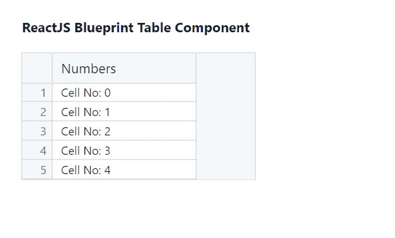
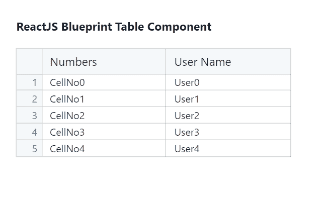

# 反应堆蓝图表组件

> 原文:[https://www . geesforgeks . org/reactjs-蓝图-表格-组件/](https://www.geeksforgeeks.org/reactjs-blueprint-table-component/)

是一个基于反应的网络用户界面工具包。该库非常适合构建桌面应用程序的复杂数据密集型界面，并且非常受欢迎。表格组件允许用户显示数据行。我们可以在 ReactJS 中使用以下方法来使用 ReactJS 蓝图表组件。

**桌面道具:**

*   **numRows:** 用于设置行数。
*   **cellRenderer:** 用于定义数据如何显示，我们可以在每个列组件上设置。T3】

**创建反应应用程序并安装模块:**

*   **步骤 1:** 使用以下命令创建一个反应应用程序:

    ```
    npx create-react-app foldername
    ```

*   **步骤 2:** 创建项目文件夹(即文件夹名**)后，使用以下命令移动到该文件夹中:**

    ```
    cd foldername
    ```

*   **步骤 3:** 创建 ReactJS 应用程序后，使用以下命令安装所需的****模块:****

    ```
    **npm install @blueprintjs/core
    npm install --save @blueprintjs/table**
    ```

******项目结构:**如下图。****

****

项目结构**** 

******示例 1:** 现在在 **App.js** 文件中写下以下代码。这里，我们显示了表组件中的一列。****

## ****App.js****

```
**import React from 'react'
import '@blueprintjs/core/lib/css/blueprint.css';
import '@blueprintjs/table/lib/css/table.css';
import { Column, Cell, Table } from "@blueprintjs/table";

function App() {

    // Sample Column data
    const sampleColumn = (index) => {
        return <Cell> CellNo{index}</Cell>
    };

    return (
        <div style={{ display: 'block', 
                      width: 300, 
                      padding: 30 }}>
            <h4>ReactJS Blueprint Table Component</h4>
            <Table numRows={5}>
                <Column name="Numbers" 
                        cellRenderer={sampleColumn} />
            </Table>
        </div>
    );
}

export default App;**
```

******说明:**我们使用了表格组件以表格的形式显示数据，这里我们显示了一个标题为 *Numbers、*的 Column，我们传递了自定义的 *sampleColumn* 函数，该函数返回一个单元格来显示示例文本 *CellNo* 和*T9【这个函数被调用了五次，正如我们指定的 *numRows={5}。******

******运行应用程序的步骤:**从项目的根目录使用以下命令运行应用程序:****

```
**npm start**
```

******输出:**现在打开浏览器，转到***http://localhost:3000/***，会看到如下输出:****

********

******示例 2:** 现在在 **App.js** 文件中写下以下代码。这里，我们显示了一个表组件中的多个列。****

## ****App.js****

```
**import React from 'react'
import '@blueprintjs/core/lib/css/blueprint.css';
import '@blueprintjs/table/lib/css/table.css';
import { Column, Cell, Table } from "@blueprintjs/table";

function App() {

    // Sample Column One data
    const sampleColumnOne = (index) => {
        return <Cell> CellNo{index}</Cell>
    };

    // Sample Column two data
    const sampleColumnTwo = (index) => {
        return <Cell> User{index}</Cell>
    };

    return (
        <div style={{ display: 'block',
                      width: 390,
                      padding: 30 }}>
            <h4>ReactJS Blueprint Table Component</h4>
            <Table numRows={5}>
                <Column name="Numbers" 
                        cellRenderer={sampleColumnOne} />
                <Column name="User Name" 
                        cellRenderer={sampleColumnTwo} />
            </Table>
        </div>
    );
}

export default App;**
```

******说明:**我们使用了表组件以表的形式显示数据，这里我们显示了两列，它们的标题分别为*数字*和*用户名*。我们已经通过了自定义的 *sampleColumnOne* 和*samplecolumtwo*函数，该函数返回一个单元格来分别显示示例文本*单元格号*和*用户号*和这些函数被调用了五次，因为我们已经指定了 *numRows={5}。*****

******运行应用程序的步骤:**从项目的根目录使用以下命令运行应用程序:****

```
**npm start**
```

******输出:**现在打开浏览器，转到***http://localhost:3000/***，会看到如下输出:****

********

******参考:**T2】https://blueprintjs.com/docs/#table****