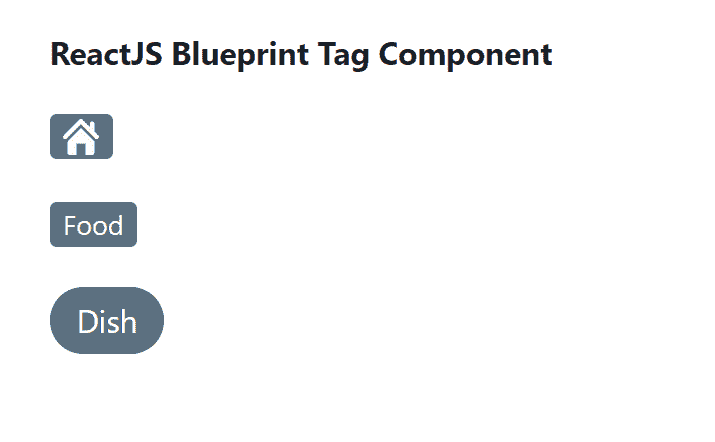

# 反应堆蓝图标签组件

> 原文:[https://www . geesforgeks . org/reactjs-蓝图-标签-组件/](https://www.geeksforgeeks.org/reactjs-blueprint-tag-component/)

是一个基于反应的网络用户界面工具包。该库非常适合构建桌面应用程序的复杂数据密集型界面，并且非常受欢迎。标签组件用于分类或标记。标签非常适合字符串列表。我们可以在 reatjs 中使用以下方法来使用 reatjs 蓝图标记组件。

**标签道具:**

*   **激活:**用于指示标签是否应该以激活状态出现。
*   **类名:**用于表示传递给子元素的以空格分隔的类名列表。
*   **elementRef:** 用于表示接收该组件呈现的原生 HTML 元素的引用处理程序或引用对象。
*   **填充:**用于指示标签是否应占据其容器的整个宽度。
*   **htmlTitle:** 用来表示要传递给组件的 HTML 标题。
*   **图标:**用于表示要在子级之前渲染的图标或图标元素的名称。
*   **意图:**用于表示应用于元素的视觉意图颜色。
*   **交互:**用于指示标签是否应该对用户交互进行视觉响应。
*   **大:**用来表示这个标签是否应该使用大样式。
*   **极小:**用于表示该标签是否应该使用极小样式。
*   **多行:**表示是否允许标签内容占用多行。
*   **onClick:** 是点击标签时触发的回调。
*   **onRemove:** 是移除按钮的点击处理程序。
*   **rightIcon:** 用于表示子级之后要渲染的图标或图标元素的名称。
*   **圆形:**用来表示这个标签是否应该有圆形的末端。

**创建反应应用程序并安装模块:**

*   **步骤 1:** 使用以下命令创建一个反应应用程序:

    ```jsx
    npx create-react-app foldername
    ```

*   **步骤 2:** 创建项目文件夹(即文件夹名**)后，使用以下命令移动到该文件夹中:**

    ```jsx
    cd foldername
    ```

*   **步骤 3:** 创建 ReactJS 应用程序后，使用以下命令安装所需的****模块:****

    ```jsx
    **npm install @blueprintjs/core**
    ```

******项目结构:**如下图。****

****

项目结构**** 

******示例:**现在在 **App.js** 文件中写下以下代码。在这里，App 是我们编写代码的默认组件。****

## ****App.js****

```jsx
**import React from 'react'
import '@blueprintjs/core/lib/css/blueprint.css';
import { Tag } from "@blueprintjs/core";

function App() {
    return (
        <div style={{
            display: 'block', width: 400, padding: 30
        }}>
            <h4>ReactJS Blueprint Tag Component</h4>
            <Tag icon={"home"} /> <br></br> <br></br>
            <Tag>Food</Tag> <br></br> <br></br>
            <Tag round large>Dish</Tag>
        </div >
    );
}

export default App;**
```

******运行应用程序的步骤:**从项目的根目录使用以下命令运行应用程序:****

```jsx
**npm start**
```

******输出:**现在打开浏览器，转到***http://localhost:3000/***，会看到如下输出:****

********

******参考:**T2】https://blueprintjs.com/docs/#core/components/tag****