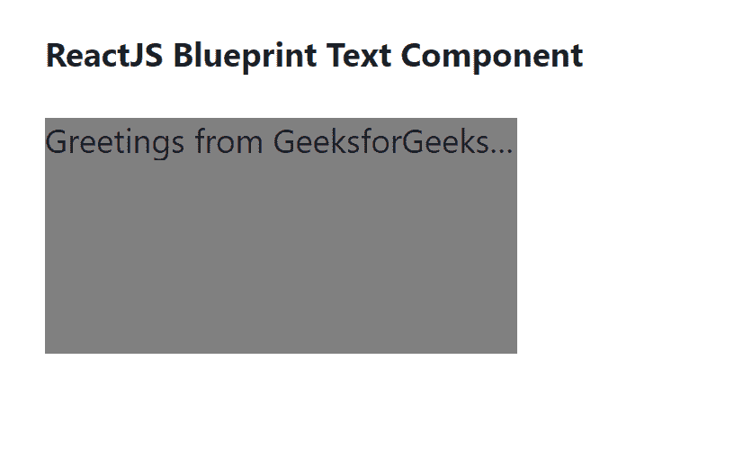

# 重新获取蓝图文本组件

> 原文:[https://www . geesforgeks . org/reactjs-蓝图-文本-组件/](https://www.geeksforgeeks.org/reactjs-blueprint-text-component/)

是一个基于反应的网络用户界面工具包。该库非常适合构建桌面应用程序的复杂数据密集型界面，并且非常受欢迎。文本组件为用户提供了一种方式 将可访问的溢出行为添加到一行文本 中。我们可以在 ReactJS 中使用以下方法来使用 ReactJS 蓝图文本组件。

**文字道具:**

*   **类名:**用于表示传递给子元素的以空格分隔的类名列表。
*   **ellipsize:** 用于表示该组件溢出其容器时应使用省略号截断。
*   **标记名:**用于表示渲染元素使用的 HTML 标记名。
*   **标题:**用于表示元素的 HTML 标题。

**创建反应应用程序并安装模块:**

*   **步骤 1:** 使用以下命令创建一个反应应用程序:

    ```jsx
    npx create-react-app foldername
    ```

*   **步骤 2:** 在创建项目文件夹(即文件夹名**)后，使用以下命令将**移动到该文件夹:

    ```jsx
    cd foldername
    ```

*   **步骤 3:** 创建 ReactJS 应用程序后，使用以下命令安装所需的****模块:****

    ```jsx
    **npm install @blueprintjs/core**
    ```

******项目结构:**如下图。****

****

项目结构**** 

******示例:**现在在 **App.js** 文件中写下以下代码。在这里，App 是我们编写代码的默认组件。****

## ****App.js****

```jsx
**import React from 'react'
import '@blueprintjs/core/lib/css/blueprint.css';
import { Text } from "@blueprintjs/core";

function App() {

    return (
        <div style={{
            display: 'block', width: 500, padding: 30
        }}>
            <h4>ReactJS Blueprint Text Component</h4>
            <div style={{width:200, height:100, backgroundColor: 'gray'}}>
                <Text ellipsize={true}>
                    Greetings from GeeksforGeeks!
                    Greetings from GeeksforGeeks!
                    Greetings from GeeksforGeeks!
                    Greetings from GeeksforGeeks!
                    Greetings from GeeksforGeeks!
                    Greetings from GeeksforGeeks!
                    Greetings from GeeksforGeeks!
                </Text>
            </div>
        </div>
    );
}

export default App;**
```

******运行应用程序的步骤:**从项目的根目录使用以下命令运行应用程序:****

```jsx
**npm start**
```

******输出:**现在打开浏览器，转到***http://localhost:3000/***，会看到如下输出:****

********

******参考:**T2】https://blueprintjs.com/docs/#core/components/text****