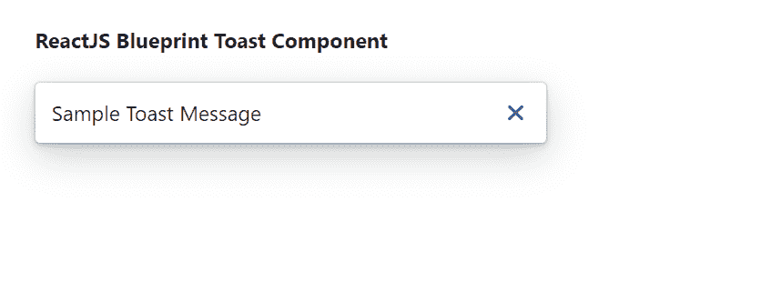

# 重新获取蓝图吐司组件

> 原文:[https://www . geeksforgeeks . org/reactjs-蓝图-吐司-组件/](https://www.geeksforgeeks.org/reactjs-blueprint-toast-component/)

是一个基于反应的网络用户界面工具包。该库非常适合构建桌面应用程序的复杂数据密集型界面，并且非常受欢迎。

吐司组件为用户提供了一种向用户显示临时消息作为覆盖的方式。我们可以在 reatjs 中使用以下方法来使用 reatjs 蓝图吐司组件。

**吐司道具:**

*   **动作:**这是一个呈现为最小锚点按钮的动作。
*   **类名:**用于表示传递给子元素的以空格分隔的类名列表。
*   **图标:**用于表示要在消息前渲染的图标或图标元素的名称。
*   **意图:**用于表示应用于元素的视觉意图颜色。
*   **消息:**用于表示要显示在吐司正文中的消息。
*   **onDismiss:** 这是一个回调函数，当用户或超时取消吐司时触发。
*   **超时:**用于表示自动解散吐司前等待的毫秒数。

**烤面包机道具:**

*   **自动对焦:**用于指示吐司首次打开时是否应获取应用焦点。
*   **canEscapeKeyClear:** 用于指示按下 ESC 键是否应清除所有活动的祝酒词。
*   **类名:**用于表示传递给子元素的以空格分隔的类名列表。
*   **最大敬酒次数:**用于表示一次可以显示的最大活跃敬酒次数。
*   **位置:**用于表示烤面包机在其容器内的位置。
*   **使用门户:**用于指示是否应该将烤面包机渲染为附加到*文档正文*的新元素。

**创建反应应用程序并安装模块:**

*   **步骤 1:** 使用以下命令创建一个反应应用程序:

    ```jsx
    npx create-react-app foldername
    ```

*   **步骤 2:** 创建项目文件夹(即文件夹名**)后，使用以下命令移动到该文件夹中:**

    ```jsx
    cd foldername
    ```

*   **步骤 3:** 创建 ReactJS 应用程序后，使用以下命令安装所需的****模块:

    ```jsx
    npm install @blueprintjs/core
    ```**** 

******项目结构:**如下图。****

****

项目结构**** 

******示例:**现在在 **App.js** 文件中写下以下代码。在这里，App 是我们编写代码的默认组件。****

## ****appp.js 文件****

```jsx
**import React from 'react'
import '@blueprintjs/core/lib/css/blueprint.css';
import { Toast } from "@blueprintjs/core";

function App() {
    return (
        <div style={{
            display: 'block', width: 400, padding: 30
        }}>
            <h4>ReactJS Blueprint Toast Component</h4>
            <Toast message='Sample Toast Message' />
        </div >
    );
}

export default App;**
```

******运行应用程序的步骤:**从项目的根目录使用以下命令运行应用程序:****

```jsx
**npm start**
```

******输出:**现在打开浏览器，转到***http://localhost:3000/***，会看到如下输出:****

********

******参考:**T2】https://blueprintjs.com/docs/#core/components/toast****