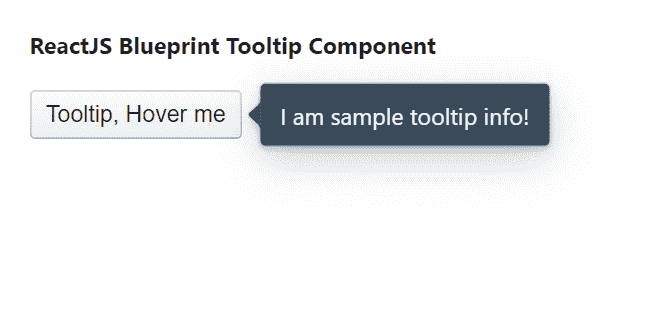

# 反应蓝图工具提示组件

> 原文:[https://www . geeksforgeeks . org/reactjs-蓝图-工具提示-组件/](https://www.geeksforgeeks.org/reactjs-blueprint-tooltip-component/)

是一个基于反应的网络用户界面工具包。该库非常适合构建桌面应用程序的复杂数据密集型界面，并且非常受欢迎。

工具提示组件为用户提供了一种在悬停交互期间显示附加信息的方式，因为这是一个轻量级弹出窗口。我们可以在 reatjs 中使用以下方法来使用 reatjs 蓝图工具提示组件。

**工具提示道具：**

*   **自动对焦:**用于指示叠加首次打开时是否应获取应用焦点。
*   **边界:**用于确定 Popper 用于其翻转和 preventOverflow 修改器的边界元素。
*   **canescapekeycloose:**用于指示按 esc 键是否应该调用 onClose。
*   **当用户点击一个类时，捕捉消失:**。当这个参数设置为真时，popover _ SILOW 元素将只关闭当前 POPOVER，而不关闭外部 POPOVER。
*   **类名:**用于表示传递给子元素的以空格分隔的类名列表。
*   **内容:**用于表示工具提示内部将要显示的内容。
*   **defaultIsOpen:** 用于表示不受控制时的初始打开状态。
*   **禁用:**用于防止真时爆音出现。
*   **enforceFocus:** 用于表示叠加是否要防止焦点自行离开。
*   **悬停关闭延迟:**用于表示用户悬停在触发器上后，工具提示应保持打开的时间，以毫秒为单位。
*   **悬停打开延迟:**用于表示用户悬停在触发器上后，工具提示在打开前应等待的时间，以毫秒为单位。
*   **继承黑暗主题:**用于指示使用门户的 popover 是否应该自动从其父级继承黑暗主题。
*   **意图:**用于表示应用于元素的视觉意图颜色。
*   **交互种类:**用于表示触发工具提示显示的悬停交互种类。
*   **isOpen:** 用于指示 popover 是否可见。
*   **lazy:** 当覆盖被设置为 true 并且 usePortal={true}时，当第一次打开覆盖时，包含子对象的 Portal 被创建并附加到 DOM。
*   **最小:**用于指示是否对此弹出窗口或工具提示应用最小样式。
*   **修改器:**用于表示 popper 修改器选项，直接传递给内部 Popper 实例。
*   **onClose:** 是用户交互导致叠加关闭时触发的回调函数，如点击叠加或按 esc 键。
*   **onClosed:** 它用于表示在 CSS close 转换结束之后，但在子元素从 DOM 中移除之前调用的生命周期方法。
*   **onClosing:** 它用于表示就在子对象上 CSS 关闭转换开始之前调用的生命周期方法。
*   **onInteraction:** 这是一个回调函数，当 popover 打开状态因用户交互而改变时，在受控模式下触发。
*   **onOpened:** 用来表示 CSS 开放转换结束后刚刚调用的生命周期方法。
*   **on open:**用于表示在 DOM 中挂载子元素之后，CSS 打开转换开始之前调用的生命周期方法。
*   **openOnTargetFocus:** 用于指示 popover 在目标聚焦时是否应该打开。
*   **放置:**用于弹出窗口出现的位置(相对于目标)。
*   **popover 类名:**用于表示应用于 popover 元素的以空格分隔的类名字符串。
*   **portalClassName:** 如果 usePortal={true}，则用于表示应用于 Portal 元素的以空格分隔的类名字符串。
*   **portalContainer:** 当 usePortal 为 true 时，用于表示覆盖图将其内容呈现到的容器元素。
*   **位置:**用于表示爆音出现的位置(相对于目标)。
*   **目标类名:**用于表示应用于目标元素的以空格分隔的类名字符串。
*   **targetProps:** 用来表示要扩散到目标元素的 HTML 道具。
*   **目标标记名:**用于表示目标元素的 HTML 标记名。
*   **过渡持续时间:**用于指示工具提示出现/消失过渡需要多长时间，单位为毫秒。
*   **使用门户:**用于指示弹出窗口是否应该在附加到门户容器道具的门户中呈现。
*   **wrapperTagName:** 它用于表示包装元素的 HTML 标记名，包装元素也接收类名 prop。

**创建反应应用程序并安装模块:**

*   **步骤 1:** 使用以下命令创建一个反应应用程序:

    ```
    npx create-react-app foldername
    ```

*   **步骤 2:** 创建项目文件夹后，即文件夹名称**，**使用以下命令移动到项目文件夹:

    ```
    cd foldername
    ```

*   **步骤 3:** 创建 ReactJS 应用程序后，使用以下命令安装所需的****模块:****

    ```
    **npm install @blueprintjs/core**
    ```

******项目结构:**如下图。****

****

项目结构**** 

******示例:**现在在 **App.js** 文件中写下以下代码。在这里，App 是我们编写代码的默认组件。****

## ****App.js****

```
**import React from 'react'
import '@blueprintjs/core/lib/css/blueprint.css';
import { Tooltip, Button } from "@blueprintjs/core";

function App() {
    return (
        <div style={{
            display: 'block', width: 400, padding: 30
        }}>
            <h4>ReactJS Blueprint Tooltip Component</h4>
            <Tooltip content="I am sample tooltip info!" position='right'>
                <Button>Tooltip, Hover me</Button>
            </Tooltip>
        </div >
    );
}

export default App;**
```

******运行应用程序的步骤:**从项目的根目录使用以下命令运行应用程序:****

```
**npm start**
```

******输出:**现在打开浏览器，转到***http://localhost:3000/***，会看到如下输出:****

********

******参考:**T2】https://blueprintjs.com/docs/#core/components/tooltip****