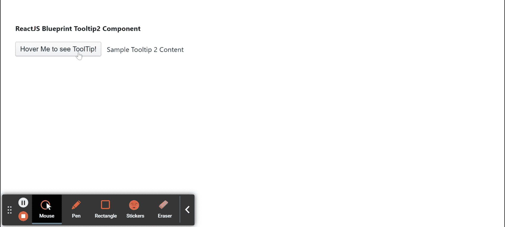

# 重新获取蓝图工具提示 2 组件

> 原文:[https://www . geeksforgeeks . org/reactjs-蓝图-tool tip 2-组件/](https://www.geeksforgeeks.org/reactjs-blueprint-tooltip2-component/)

是一个基于反应的网络用户界面工具包。该库非常适合构建桌面应用程序的复杂数据密集型界面，并且非常受欢迎。

Tooltip2 组件为用户提供了一种在悬停交互过程中查看附加信息的方式，因为它是一个轻量级弹出窗口。  我们可以在 ReactJS 中使用以下方法来使用 ReactJS 蓝图工具提示 2 组件。

**工具提示 2 道具：**

*   **自动对焦:**用于指示叠加首次打开时是否应获取应用焦点。
*   **边界:**用于表示提供给*翻转*和*防止过流*修改器的边界元素。
*   **canEscapeKeyClose:** 用于指示按下 ESC 键是否应调用 *onClose* 。
*   **捕捉关闭:**当用户点击一个*类时。当这个道具被启用时，popover _ 蔑*元素只会关闭当前 POPOVER，而不会关闭外部 POPOVER。
*   **类名:**用于表示传递给子元素的以空格分隔的类名列表。
*   **内容:**用于表示工具提示内部将要显示的内容。
*   **defaultIsOpen:** 用于表示不受控制时的初始打开状态。
*   **禁用:**用于防止真时爆音出现。
*   **enforceFocus:** 用于指示叠加是否应该阻止焦点离开自身。
*   **悬停关闭延迟:**用于表示用户悬停在触发器上后工具提示应保持打开的时间(以毫秒为单位)。
*   **悬停打开延迟:**用于表示用户悬停在触发器上后，工具提示在打开前应等待的时间(以毫秒为单位)。
*   **继承黑暗主题:**用于指示使用门户的 popover 是否应该自动从其父级继承黑暗主题。
*   **意图:**用于表示应用于元素的视觉意图颜色。
*   **交互种类:**用于表示触发工具提示显示的悬停交互种类。
*   **isOpen:** 表示波波头是否可见。
*   **lazy:** 当覆盖被设置为 true 并且 usePortal 为 true 时，当第一次打开覆盖时，包含子对象的 Portal 被创建并附加到 DOM。
*   **最小:**用于指示是否对此弹出窗口或工具提示应用最小样式。
*   **修改器:**用于覆盖 Popper.js 内置修改器。
*   **onClose:** 是用户交互导致覆盖关闭时触发的回调。
*   **onClosed:** 它用于表示在 CSS close 转换结束之后，但在子元素从 DOM 中移除之前调用的生命周期方法。
*   **onClosing:** 它用于表示在 CSS 关闭转换开始之前在子对象上调用的生命周期方法。
*   **onInteraction:** 这是一个回调函数，当 popover 打开状态因用户交互而改变时，在受控模式下触发。
*   **onOpened:** 用于表示在 CSS 开放转换结束后调用的生命周期方法。
*   **on open:**用于表示在 DOM 中挂载子元素之后，CSS 打开转换开始之前调用的生命周期方法。
*   **openOnTargetFocus:** 用于指示当目标聚焦时弹出窗口是否应该打开。
*   **位置:**用于表示波波头出现的位置。
*   **popover 类名:**用于表示应用于 popover 元素的以空格分隔的类名字符串。
*   **portalClassName:** 如果 usePortal 为 true，则用于表示应用于 Portal 元素的以空格分隔的类名字符串。
*   **portalContainer:** 用于表示当 usePortal 为 true 时，覆盖将其内容呈现到其中的容器元素。
*   **位置:**用来表示波波头应该出现的位置。与放置道具互斥。
*   **renderTarget:** 用于表示接收 Popover2 注入的道具的目标渲染器，这些道具应该扩散到渲染的元素上。
*   **根边界:**用于表示提供给*翻转*和*预防流*修改器的根边界元素。
*   **目标标记名:**用于表示目标元素的 HTML 标记名。
*   **过渡持续时间:**用于指示工具提示出现/消失过渡需要多长时间，单位为毫秒。
*   **使用门户:**用于指示弹出窗口是否应该在附加到门户容器道具的门户中呈现。

**创建反应应用程序并安装模块:**

*   **步骤 1:** 使用以下命令创建一个反应应用程序:

    ```jsx
    npx create-react-app foldername
    ```

*   **步骤 2:** 创建项目文件夹(即文件夹名**)后，使用以下命令移动到该文件夹中:**

    ```jsx
    cd foldername
    ```

*   **步骤 3:** 创建 ReactJS 应用程序后，使用以下命令安装所需的****模块:****

    ```jsx
    **npm install @blueprintjs/core
    npm install @blueprintjs/popover2**
    ```

******项目结构:**如下图。****

****

项目结构**** 

******示例:**现在在 **App.js** 文件中写下以下代码。在这里，App 是我们编写代码的默认组件。****

## ****App.js****

```jsx
**import React from 'react'
import '@blueprintjs/core/lib/css/blueprint.css';
import { Button, mergeRefs } from "@blueprintjs/core";
import { Popover2, Tooltip2 } from "@blueprintjs/popover2";

function App() {

    return (
        <div style={{
            display: 'block', width: 400, padding: 30
        }}>
            <h4>ReactJS Blueprint Tooltip2 Component</h4>
            <Popover2
                content={<h1>Popover!</h1>}
                renderTarget={({ isOpen: isPopoverOpen,
                    ref: ref1, ...popoverProps }) => (
                    <Tooltip2
                        content="Sample Tooltip 2 Content"
                        disabled={isPopoverOpen}
                        renderTarget={({ isOpen: isTooltipOpen,
                            ref: ref2, ...tooltipProps }) => (
                            <Button
                                active={isPopoverOpen}
                                {...popoverProps}
                                {...tooltipProps}
                                text="Hover Me to see ToolTip!"
                                elementRef={mergeRefs(ref1, ref2)}
                            />
                        )}
                    />
                )}
            />
        </div >
    );
}

export default App;**
```

******运行应用程序的步骤:**从项目的根目录使用以下命令运行应用程序:****

```jsx
**npm start**
```

******输出:**现在打开浏览器，转到***http://localhost:3000/***，会看到如下输出:****

********

******参考:**T2】https://blueprintjs.com/docs/#popover2-package/tooltip2****