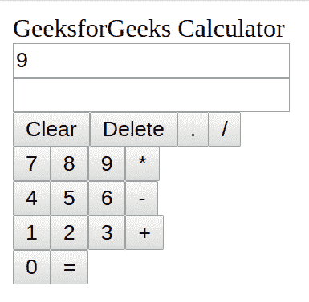

# 反应|计算器应用程序(添加功能)

> 原文:[https://www . geeksforgeeks . org/reactjs-calculator-app-add-functionality/](https://www.geeksforgeeks.org/reactjs-calculator-app-adding-functionality/)

在我们之前的文章中，我们已经构建了用户界面的结构，但是我们没有给它添加样式，也没有添加任何功能。你可以看到，如果你现在点击按钮，屏幕上什么都不会被输入。因此，在本文中，我们将尝试使我们的计算器应用程序完全正常运行。一旦我们的应用变得实用，我们将添加 CSS 来设计我们的应用。

那么，让我们开始吧。我们将添加的第一个功能是按钮的点击事件。为了处理点击事件，我们将创建一个名为 *handleClick* 的新函数，并将该函数添加到我们的*计算器*组件类中。但是，接下来要观察的是，“0-9”的按钮和“+、-、*、/”这样的运算符会有不同的角色，而“=”、“清除”和“删除”这样的按钮会有不同的角色。因此，我们可以在*手柄点击*功能中使用*开关..case* 语句对点击不同的按钮执行不同的操作。

但是在这样做之前，让我们看看我们需要什么样的状态？我们需要为我们的 Calculator 应用程序创建两个状态，我们将根据用户输入更新这两个状态。我们需要的两种状态是:

*   **问题**:最初这个状态会用空字符串初始化。该状态将用于存储用户输入。
*   **回答**:最初这个状态会用空字符串初始化。该状态将用于存储状态*问题*中存储的用户输入评估结果。

在文件 **calculator.js** 中的 Calculator 类顶部添加下面的代码。该代码将为我们创建所需的状态:

```jsx
constructor() {
    super();

    // set our default state
    this.state = {
      question: '',
      answer: ''
    }

    // Bind our handleClick method (sets 'this' explicitly
    // to refer to this componenent) We did this because 'this'
    // would refer to the source of the click events
    this.handleClick = this.handleClick.bind(this);
  }
```

从现在开始，我们已经创建了状态来存储用户输入和答案。让我们完成*手柄点击*功能，根据不同的按钮点击更新这些状态。

将以下函数添加到**计算器. js** 文件中的计算器类中:

```jsx
// our method to handle all click events from our buttons
handleClick(event){

  // get the value from the target element (button)
  const value = event.target.value;

  switch (value) {
    case '=': {

      // if it's an equal sign, use the eval module
      // to evaluate the question ,convert the answer
      // (in number) to String
      if (this.state.question!=='')
      {
          var ans='';
            try
              {
                  ans = eval(this.state.question);
              }
              catch(err)
              {
                  this.setState({answer: "Math Error"});
              }
              if (ans===undefined)
                  this.setState({answer: "Math Error"});

              // update answer in our state.
              else
                  this.setState({ answer: ans , question: ''});
              break;
          }
    }
    case 'Clear': {

      // if it's the Clears sign, just clean our 
      // question and answer in the state
      this.setState({ question: '', answer: '' });
      break;
    }

    case 'Delete': {
      var str = this.state.question;
        str = str.substr(0,str.length-1);
        this.setState({question: str});
        break;
    }

  default: {

      // for every other command, update the answer in the state
      this.setState({ question: this.state.question += value})
      break;
    }
  }
}
```

现在，我们已经完成了所有功能的添加，但是，如果我们在浏览器中单击计算器应用程序的按钮，什么也不会发生。这背后的原因是我们没有在 button.js 文件的 button 组件中将 *handleClick* 函数与按钮的 onClick 属性链接起来。为此，我们将把*手柄点击*功能作为道具传递给按钮组件，并将该功能分配给按钮组件中的按钮 onClick 事件。

我们将在我们的计算器组件中的任何地方添加下面的行，从这里我们调用我们的按钮组件，将 handleClick 函数作为道具传递给按钮组件:

```jsx
handleClick = {this.handleClick}

```

添加之后，我们将转到 button.js 文件，并将下面的属性添加到输入字段中:

```jsx
onClick = {props.handleClick}

```

现在一切都准备好了。点击我们的按钮，我们的状态就会更新。但是等等，我们在浏览器中仍然看不到我们的应用程序有任何变化。让我们回想一下出了什么问题。问题是我们没有将状态传递给输出屏幕组件。所以我们的 OutputScreen 组件没有任何东西可以在屏幕上呈现。因此，让我们更新我们的输出屏幕和输出屏幕行组件来接受道具，并将*问题*和*答案*状态从计算器组件传递到输出屏幕组件作为道具。

完成此操作后，将输出屏幕组件内部的道具作为值传递给输出屏幕行组件，以在输入字段中显示它们。

以下是我们最终的 **outputscreen.js** 文件:

```jsx
// Import React (Mandatory Step).
import React from 'react';

// Import Output Screen Row.
import OutputScreenRow from './outputScreenRow.js';

// Functional Component.
// Use to hold two Screen Rows.
const OutputScreen = (props) => {
  return (
    <div className="screen">
      <OutputScreenRow value = {props.question}/>
      <OutputScreenRow value = {props.answer}/>
    </div>
  )
}

// Export Output Screen.
export default OutputScreen;
```

以下是我们最终的 **outputscreenrow.js** 文件:

```jsx
// Import React (Mandatory Step).
import React from 'react';

// Functional Component.
// Used to show Question/Answer.
const OutputScreenRow = (props) => {
  return (
    <div className="screen-row">
      <input type="text" readOnly value = {props.value}/>
    </div>
  )
}

// Export Output Screen Row.
export default OutputScreenRow;
```

您可以在下图中看到，我们的计算器应用程序运行良好，与我们在第一篇文章中看到的功能相同。在我们的下一篇文章中，我们将为此添加样式，并将尝试总结我们迄今为止为构建该应用程序所做的工作。



[ReactJS |计算器应用程序(样式)](https://www.geeksforgeeks.org/reactjs-calculator-app-styling/?ref=rp)