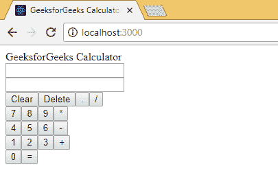

# ReactJS |计算器应用(建筑界面)

> 原文:[https://www . geeksforgeeks . org/reactjs-calculator-app-building-ui/](https://www.geeksforgeeks.org/reactjs-calculator-app-building-ui/)

在[之前的文章](https://www.geeksforgeeks.org/reactjs-calculator-app-structure/)中，我们创建了我们的第一个应用程序，删除了所有我们不需要的文件，并创建了一些我们将来需要的文件。现在，在我们目前的情况下，我们面前有一块空白的画布，我们将不得不创建我们的计算器应用程序。

在开始实际开发某个东西之前，让我们先计划一下本文将涉及的方向。这篇文章将在继续开发逻辑之前，介绍计算器基本结构的开发。

首先从 calculator 开始，让我们首先通过在 **calculator.js** 中创建一个 Calculator 类来创建 Calculator 组件，在我们导入 react 之后，我们不需要在这个文件中渲染任何东西，所以我们不会导入 react-dom。我们也将默认导出该模块。作为一个成员函数，我们将创建一个伪 render()函数。添加后，代码如下。

```jsx
// Import React (Mandatory Step).
import React from 'react';

// Create a Class Component Calculator.
class Calculator extends React.Component {
    render()
    {
        return "GeeksforGeeks Calculator";
    }
}

// Export Calculator.
export default Calculator;
```

现在我们已经创建了计算器的主干，让我们首先创建小组件，这将使它看起来更接近计算器。让我们从计算器标题组件开始。该组件将只显示其父组件使用道具传递的标题。因此，为了简单起见，我们将只导入 react，我们将使用粗箭头方法创建一个功能组件，最后将整个模块作为默认值导出。对于标题，我们将使用 div 并传递值。下面是我们在 **calculatorTitle.js** 中的代码。

```jsx
// Import React (Mandatory Step).
import React from 'react';

// Create Functional Component.
// Takes title as props.value.
const CalculatorTitle = (props) => {
  return (
    <div className="calculator-title">
      { props.value } 
    </div>
  )
}

// Export Calculator Title.
export default CalculatorTitle;
```

接下来，我们将开发输出屏幕本身。正如我们已经讨论过的，我们需要屏幕的两个部分，每个输出和输入一个，我们需要组件屏幕行。
现在这个屏幕行组件是一个相当简单的组件，它将显示传递给它的任何内容。为了简单起见，我们将只导入 react，我们将使用粗箭头方法创建一个功能组件，最后将整个模块作为默认值导出。对于屏幕行，我们将使用一个输入字段，并将其设为只读，这样用户就不能修改该值。下面是我们在**文件中编码的内容。**

```jsx
// Import React (Mandatory Step).
import React from 'react';

// Functional Component.
// Used to show Question/Answer.
const OutputScreenRow = () => {
  return (
    <div className="screen-row">
      <input type="text" readOnly/>
    </div>
  )
}

// Export Output Screen Row.
export default OutputScreenRow;
```

所以我们已经创建了输出屏幕行组件，现在我们知道我们的屏幕本身将是一个组件，由两个输出屏幕行组成。所以我们将导入 React 和我们刚刚创建的 OutputScreenRow 组件，我们不需要在这个文件中渲染任何东西，因此我们不需要 react-dom。输出屏幕本身只是一个简单的组件，用作输出屏幕的容器，因此我们将使用粗箭头方法将其创建为功能组件，并添加一个由两个输出屏幕行组件组成的渲染函数，最后将其导出为默认值。编码完成后，文件 **outputScreen.js** 会是这样的。

```jsx
// Import React (Mandatory Step).
import React from 'react';
// Import Output Screen Row.
import OutputScreenRow from './outputScreenRow.js';

// Functional Component.
// Use to hold two Screen Rows.
const OutputScreen = () => {
  return (
    <div className="screen">
      <OutputScreenRow/>
      <OutputScreenRow/>
    </div>
  )
}

// Export Output Screen.
export default OutputScreen;
```

现在我们已经创建了屏幕部分，剩下的就是键盘了。键盘将是一组按钮。现在，每个按钮都将是独立的组件，因此现在我们需要开发按钮组件。与其他组件类似，我们将只导入 react，我们将再次使用粗箭头方法创建一个功能组件，并将创建渲染函数来返回一个按钮类型的输入，其值与从父组件发送的值相同，最后我们将它导出为默认导出。完成后，文件**按钮. js** 的内容将如下所示。

```jsx
// Import React (Mandatory Step).
import React from 'react';

// Create our Button component as a functional component.
const Button = (props) => {
  return (
    <input
      type="button"
      value={props.label}
    />
  );
}

// Export our button component.
export default Button;
```

现在，我们已经完成了较小组件的开发，预计将组装并创建看起来更像计算器的应用程序。我们将返回到我们创建的 Calculator.js 文件，并相应地更新渲染函数。首先，我们将在屏幕组件后面添加计算器的标题。现在我们需要设置我们的键盘。对于我们的键盘，我们将使用按钮行，我们将使用类名按钮行来区分每一行。因此，我们需要导入用户定义的组件 CalculatorTitle、OutputScreen 和 Button。因此更新后，文件**计算器. js** 将如下所示。

```jsx
// Imports.
import React from 'react';
import CalculatorTitle from './calculatorTitle.js';
import OutputScreen from './outputScreen.js';
import Button from './button.js';

class Calculator extends React.Component {
    render()
    {
    return (
    <div className="frame">
    <CalculatorTitle value="GeeksforGeeks Calculator"/>
    <div class="mainCalc">
    <OutputScreen/>
    <div className="button-row">
      <Button label={'Clear'}/>
      <Button label={'Delete'}/>
      <Button label={'.'}/>
      <Button label={'/'}/>
    </div>
    <div className="button-row">
      <Button label={'7'}/>
      <Button label={'8'}/>
      <Button label={'9'}/>
      <Button label={'*'}/>
    </div>
    <div className="button-row">
      <Button label={'4'}/>
      <Button label={'5'}/>
      <Button label={'6'}/>
      <Button label={'-'}/>
    </div>
    <div className="button-row">
      <Button label={'1'}/>
      <Button label={'2'}/>
      <Button label={'3'}/>
      <Button label={'+'}/>
    </div>
    <div className="button-row">
      <Button label={'0'}/>
      <Button label={'='}/>
    </div>
    </div>
    </div>
    );
  }
}

// Export Calculator Component.
export default Calculator;
```

到目前为止，我们已经创建了所有组件，并将它们堆叠在一起以创建基本结构。现在我们只需要在 **index.js** 文件中导入计算器，并在其中进行渲染。因此，我们需要导入 react 和 react-dom，并使用 ReactDOM 的呈现方法来呈现计算器组件。index.js 文件的内容如下所示。

```jsx
import React from 'react';
import ReactDOM from 'react-dom';
import Calculator from './components/calculator.js';

// Render the Calculator to the Web page.
ReactDOM.render(<Calculator />, document.getElementById('root'));
```

按照每个步骤，我们得到的输出如下图所示。

[](https://media.geeksforgeeks.org/wp-content/uploads/gfg_barebones-1.jpg)

所以现在我们终于可以在浏览器中看到输出了，但是等等，这和我们在介绍性文章中展示的完全不同！是的，它离完成的项目还很远，它是一个准系统结构，它所需要的只是我们将在即将发布的一篇文章中提供的 CSS 修饰，但是在此之前，我们必须实现这个计算器的工作逻辑，以便在我们将这个刚性设计转化为一些吸引眼球的杰作或至少是一个体面的模型之前，它至少可以工作。

[反应|计算器应用程序(添加功能)](https://www.geeksforgeeks.org/reactjs-calculator-app-adding-functionality/?ref=rp)