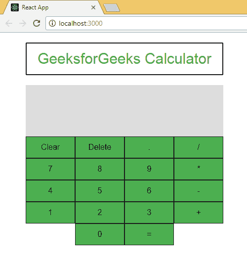

# ReactJS |计算器 App(简介)

> 原文:[https://www . geeksforgeeks . org/reactjs-calculator-app-introduction/](https://www.geeksforgeeks.org/reactjs-calculator-app-introduction/)

到目前为止，我们已经看到了 React 是什么，它能做什么。简而言之，我们知道了什么是 React 网络应用，React 组件，道具，React 组件的状态和生命周期。我们还使用以下所有内容创建了一个基本的时钟应用程序。但是 React 是一个 javascript 库，用于构建灵活的用户界面，到目前为止，我们还没有创建任何用户界面。因此，现在是我们通过创建一个简单而有影响力的项目来进入 React 的真实世界的时候了。

我们这篇文章的目的是向我们的读者介绍一个与我们一起开发的移动学习的新想法，我们选择创建一个**反应计算器**作为我们的第一个项目。没有什么比这更好的方法来计算这样一个伟大的开始旅行的英里数了。

**为什么是计算器？**

我们选择开发计算器是出于一些特定的原因，其中大部分都被简单地提到和描述了。

*   **简单:**计算器是一个简单的小工具，你已经看到、使用、误用了其中的几个。你已经看到了许多不同的计算器，现在我们给你机会创建一个基本的虚拟计算器，它将能够完成所有基本的算术运算，如加法、减法、乘法和除法。这么简单，我们两个都更容易解释和理解这个过程。
*   **范围:**我们针对的可能很简单，但是未来有很大的范围。在本文中，我将向您展示一个完整的应用程序，您将能够理解，尽管它是完整的，但它将为您提供即兴创作和创建一个针对特定领域的增强版本，例如开发科学计算器；这取决于你。
*   **丰富的有趣点:**计算器可能是一件非常简单的事情，但是如果你想为自己创建一个，你需要识别和创建所有不同的组件，识别和建立一个相互交互的平台，最后但同样重要的是，你必须处理所有的故障、崩溃和 bug。
*   **化妆挑战:**如果你对细节有诀窍，那么开发和设计一个计算器将是一个很好的起点，因为计算器本身不应该占用很多空间，但它有几个按钮来容纳，在设计时，你还必须考虑可读性和整体用户体验，因为在一天结束时，这是你的第一个**用户界面项目**。

**已完成项目一瞥**

 
长得好看吗？让我们开始我们的旅程吧。快乐编码。

[ReactJS |计算器 App(结构)](https://www.geeksforgeeks.org/reactjs-calculator-app-structure/?ref=rp)