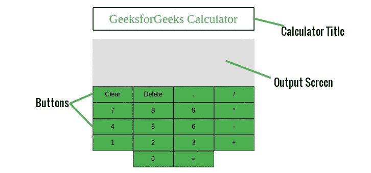
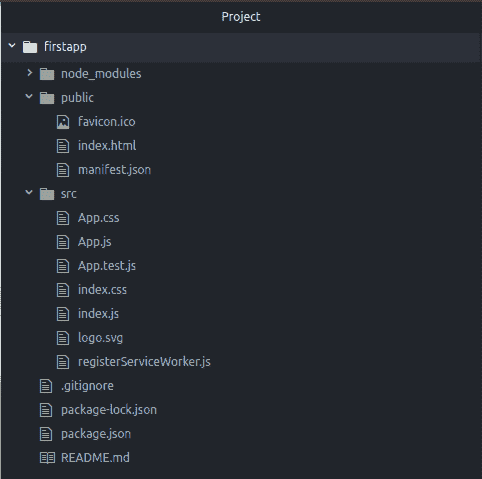
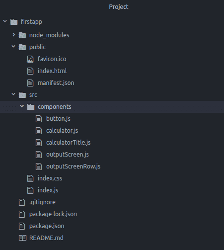

# ReactJS |计算器 App(结构)

> 原文:[https://www . geeksforgeeks . org/reactjs-calculator-app-structure/](https://www.geeksforgeeks.org/reactjs-calculator-app-structure/)

在我们之前的文章中，我们已经谈到了我们将要开发的一个计算器应用程序，也看到了我们最终项目的一瞥。在本文中，我们将准备好开始开发我们的第一个应用程序。

我们之前也说过，我们将在 React 中开发的每个应用程序都将由称为组件的部分组成。我们可以看到一个用户界面被分解成多个独立的部分，称为组件，并独立地处理它们，将它们合并到一个父组件中，这将是您的最终用户界面。所以现在让我们试着把计算器应用的用户界面分解成更小的部分。在将用户界面分成小块后，我们将获得以下元素:

*   **计算器标题**:这是我们应用程序顶部的标题，“GeeksforGeeks 计算器”。
*   **输出屏幕**:这将是我们的输出屏幕，所有的文字都会显示在这里。比如用户将要键入的输入和根据用户输入计算的答案。因此，我们可以再次将其分解为两个更小的部分，如下所示:
    *   **问题输出**:这将是用户给出的输入。
    *   **答案输出**:这将是根据用户输入计算的结果。
*   **按钮**:正如你在我们的计算器应用程序的图片中看到的，我们已经使用了很多按钮来输入‘0-9’的数字、运算符、清除屏幕、退格等。



因此，上面显示的元素是我们可以破坏完整的计算器应用程序的最小元素。因此，我们将为每个元素创建组件。因此，我们已经看到了我们的应用程序的结构，让我们朝着开发它迈出第一步。我们将从一开始就在这个项目中做事情，即通过创建一个反应应用程序，构建单个组件等。

现在让我们使用 create-react-app 命令创建我们的应用程序。打开您的终端，键入以下命令:

```
create-react-app firstapp

```

这里 *firstapp* ，是我们 react 应用的名字。您可以为您的应用程序选择任何您想要的名称，但是请确保您的应用程序的名称只能是小写字母。成功执行上述命令后，React 将创建一个名为“firstapp”的目录。这个目录将包含我们应用程序的所有文件。下图显示了 React 为我们的应用程序*第一个应用程序*创建的默认文件。


现在，正如你在上面的图片中看到的，React 已经为我们创建了许多文件。但我们实际上并不需要全部。我们将创建并使用自己的文件。所以，打开 *src* 目录，删除所有文件，创建两个新文件，名字分别是‘index . js’和‘index . CSS’。此外，进入公共目录，从*index.html*文件中删除所有预先编写的代码，并在其中添加以下代码。

下面是我们的 **/public/index.html** 文件:

```
<!DOCTYPE html>
<html lang="en">
  <head>
    <meta charset="utf-8">
    <meta name="viewport" content="width=device-width,
                        initial-scale=1, shrink-to-fit=no">
    <title>GeeksforGeeks Calculator</title>
  </head>
  <body>

    <!-- This is the element where our entire
         app will be rendered -->
    <div id="root"></div>

  </body>
</html>
```

因此，我们已经完成了我们的应用程序设置，现在让我们开始创建我们的组件。正如我们上面讨论的。我们总共需要四个组件，如下所示:

1.  **计算器**:这将是父组件，将代表整个计算器应用程序作为一个整体。
2.  **CalculatorTitle** :这个组件将用于渲染我们应用程序顶部的标题“GeeksforGeeks Calculator”。
3.  **输出屏幕**:该组件将用于屏幕上显示的所有文本。
4.  **输出屏幕行**:该组件用于输出类型，即输入文本和计算结果。
5.  **按钮**:该组件将用于我们应用程序中的所有按钮。

现在让我们在我们的 *src* 文件夹中创建一个名为*组件*的新文件夹，并在这个文件夹中为上面提到的组件创建四个文件。这些文件的名称将与第一个小写字母的组件名称相同。创建所有文件后，我们的项目目录如下图所示:


到目前为止，我们已经创建了计算器应用程序的基本结构。但是到目前为止，我们还没有编写任何代码，也没有设计任何东西。在我们的下一篇文章中，我们将开始为我们的组件编写代码，并将创建我们的计算器应用程序的设计。

[ReactJS |计算器应用(建筑界面)](https://www.geeksforgeeks.org/reactjs-calculator-app-building-ui/?ref=rp)