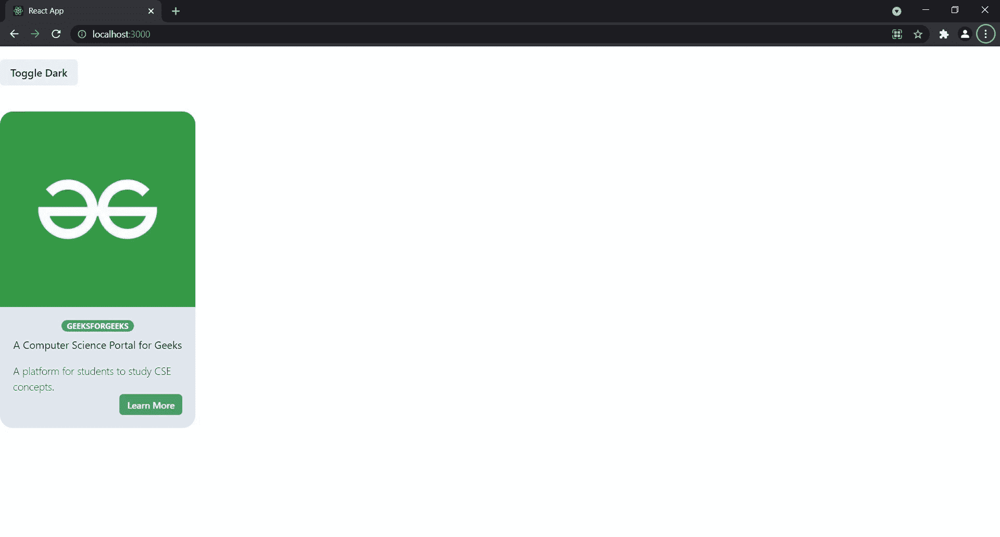

# 反应脉轮-用户界面卡组件

> 原文:[https://www . geeksforgeeks . org/reactjs-chakra-ui-card-component/](https://www.geeksforgeeks.org/reactjs-chakra-ui-card-component/)

Chakra UI 是 Segun Adebayo 为 React 创建的一个现代组件库，用于构建前端应用程序。它提供了可访问性、简单性和模块化，使其成为一个拥有 50 多个组件的强大库。Chakra UI 附带了简洁和可审查的文档，使构建可访问的组件和加快构建过程变得更加容易。在撰写本文时，Chakra-UI GitHub 存储库有 19.4k 颗星，已经分叉了 1.6k 次。如果你是表情符号和风格系统的粉丝，那么采用查克拉是很容易的，这个库是用这些技术作为基础建立的。在本文中，我们将学习如何使用 Chakra-UI 创建一个卡片组件。

**方法:**由于 Chakra UI 没有现有的卡片组件，我们将使用它们灵活抽象的组件来创建完整的卡片。

在 App.js 文件中，导入**框、图像、堆叠、徽章、伸缩、间隔**和**文本**组件。

*   **Box:** 是最抽象的组件，默认呈现一个 div 元素。可以轻松创建响应风格和通过道具传递风格。
*   **图像:**图像组件用于显示图像以及造型和添加响应样式，
*   **堆叠:**是一个布局组件，用于将元素堆叠在一起，并在它们之间应用一个空间。
*   **Flex 和 Spacer:** 用于创建响应布局，其中子元素占据 100%的宽度，保持它们之间的间距相等。
*   **文本:**用于渲染界面内的文本和段落。

**创建反应应用程序并安装模块:**

*   **步骤 1:** 使用以下命令创建一个反应应用程序:

    ```jsx
    npx create-react-app foldername
    ```

*   **步骤 2:** 创建项目文件夹(即文件夹名)后，使用以下命令移动到该文件夹:

    ```jsx
    cd foldername
    ```

*   **步骤 3:** 创建 ReactJS 应用程序后，使用以下命令安装 Chakra UI 模块:

    ```jsx
    npm i @chakra-ui/react @emotion/react@^11 
        @emotion/styled@^11 framer-motion@^4
    ```

**项目结构:**如下图。


项目结构

下面是上述方法的实现:

**示例:**

## App.js

```jsx
import React from "react";
import { Box, Image, Badge, Text, Stack, 
    useColorMode, Button, Flex, Spacer } 
    from "@chakra-ui/react";

function App() {

  // Hook to toggle dark mode
  const { colorMode, toggleColorMode} = useColorMode();

  return (
    <div className="app">
      <Button onClick={toggleColorMode} mt={5}>
        Toggle { colorMode === "light" ? "Dark" : "Light"}
      </Button>
      <Box w="300px" rounded="20px" 
           overflow="hidden" bg={ colorMode === "dark" ? "gray
      .700": "gray.200"} mt={10}>
        <Image src=
"https://media.geeksforgeeks.org/wp-content/uploads/20210727094649/img1.jpg"
               alt="Card Image" boxSize="300px">
        </Image>
        <Box p={5}>
          <Stack align="center">
            <Badge variant="solid" colorScheme="green" 
              rounded="full" px={2}>
            GeeksForGeeks
            </Badge>
          </Stack>
          <Stack align="center">
            <Text as="h2" fontWeight="normal" my={2} >
              A Computer Science Portal for Geeks
            </Text>
            <Text fontWeight="light">
              A platform for students to study CSE concepts.
            </Text>
          </Stack>
          <Flex>  
            <Spacer />
            <Button variant="solid" 
              colorScheme="green" size="sm">
                Learn More
            </Button>
          </Flex>
        </Box>
      </Box>
    </div>
  );
}

export default App;
```

为了让查克拉用户界面工作，您需要在应用程序的根处设置查克拉提供程序。

## index.js

```jsx
import React from 'react';
import ReactDOM from 'react-dom';
import App from './App';
import { ChakraProvider, ColorModeScript } from "@chakra-ui/react";

ReactDOM.render(
  <React.StrictMode>
    <ChakraProvider>
      <ColorModeScript initialColorMode="light"></ColorModeScript>
      <App />
    </ChakraProvider>
  </React.StrictMode>,
  document.getElementById('root')
);
```

**运行应用程序的步骤:**
从项目的根目录使用以下命令运行应用程序。

```jsx
npm start
```

**输出:**现在打开浏览器，转到 **http://localhost:3000/** ，会看到如下输出。



**参考:**T2】https://chakra-ui.com/docs/getting-started