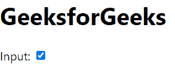
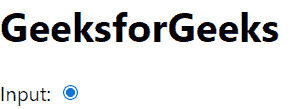

# 重新检查属性

> 原文:[https://www.geeksforgeeks.org/reactjs-checked-attribute/](https://www.geeksforgeeks.org/reactjs-checked-attribute/)

React.js 库就是将应用程序拆分成几个组件。每个组件都有自己的生命周期。React 为我们提供了一些内置的方法，我们可以在组件生命周期的特定阶段覆盖这些方法。

在本文中，我们将了解如何在 React.js 中的 checkbox 输入中使用 checked 或 defaultChecked 属性

选中的属性可以与复选框或单选按钮元素一起使用。

**创建反应应用程序并安装模块:**

*   **步骤 1:** 使用以下命令创建一个 React 应用程序。

    ```jsx
    npx create-react-app foldername
    ```

*   **第二步**:创建项目文件夹即 foldername 后，使用以下命令移动到该文件夹。

    ```jsx
    cd foldername
    ```

**项目结构:**如下图。


**示例 1:** 现在在 **App.js** 文件中写下以下代码。在这里，App 是我们编写代码的默认组件。

## App.js

```jsx
import React from 'react';

// Defining our App Component
const App = () => {

  // Returning our JSX code
  return <>
    <div>
      <h1>GeeksforGeeks</h1>
        Input: <input type='checkbox' checked={true} />
    </div>
  </>;
}

// Exporting your Default App Component
export default App
```

**运行应用程序的步骤:**从项目的根目录使用以下命令运行应用程序:

```jsx
npm start
```

**输出:**现在打开浏览器，转到***http://localhost:3000/***，会看到如下输出:



**示例 2:** 现在在 **App.js** 文件中写下以下代码。在这里，App 是我们编写代码的默认组件。

## java 描述语言

```jsx
import React from 'react';

// Defining our App Component
const App = () => {

  // Returning our JSX code
  return <>
    <div>
      <h1>GeeksforGeeks</h1>
        Input: <input type='radio' checked={true} />
    </div>
  </>;
}

// Exporting your Default App Component
export default App
```

**运行应用程序的步骤:**从项目的根目录使用以下命令运行应用程序:

```jsx
npm start
```

**输出:**现在打开浏览器，转到***http://localhost:3000/***，会看到如下输出:


**参考:**[https://reactjs.org/docs/dom-elements.html#checked](https://reactjs.org/docs/dom-elements.html#checked)