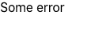

# reactjscomponentdcatch()方法

> 原文:[https://www . geeksforgeeks . org/reactjs-componentdiccatch-method/](https://www.geeksforgeeks.org/reactjs-componentdidcatch-method/)

如果在任何生命周期方法或任何子组件的呈现阶段出现错误，将调用 componentDidCatch()方法。此方法用于实现反应应用程序的错误边界。它是在提交阶段调用的，因此与在呈现阶段调用的 getDerivedStateFromError()不同，该方法允许副作用。此方法也用于记录错误。

**语法:**

```
componentDidCatch(error, info)
```

**参数:**它接受两个参数，即错误和信息，如下所述:

*   **错误:**是后代组件抛出的错误。
*   **信息:**它存储哪个组件抛出了这个错误的组件堆栈跟踪。

**创建反应应用程序:**

**步骤 1:** 使用以下命令创建一个反应应用程序:

```
npx create-react-app foldername
```

**步骤 2:** 创建项目文件夹(即文件夹名称)后，使用以下命令移动到该文件夹:

```
cd foldername
```

**项目结构:**如下图。


项目结构

**示例:**程序演示使用 componentDidCatch()方法。

**文件名:App.js:**

## java 描述语言

```
import React, { Component } from 'react';

export default class App extends Component {
  // Initializing the state
  state = {
    error: false,
  };

  componentDidCatch(error) {
    // Changing the state to true
    // if some error occurs
    this.setState({
      error: true
    });
  }

  render() {
    return (
      <React.StrictMode>
        <div>
          {this.state.error ? <div>Some error</div> : <GFGComponent />}
        </div>
      </React.StrictMode>
    );
  }
}

class GFGComponent extends Component {

  // GFGComponent throws error as state of
  // GFGCompnonent is not defined

  render() {
    return <h1>{this.state.heading}</h1>;
  }
}
```

**运行应用程序的步骤:**从项目的根目录使用以下命令运行应用程序:

```
npm start
```

**输出:**



输出

**参考:**[https://reactjs . org/docs/reat-component . html # component did catch](https://reactjs.org/docs/react-component.html#componentdidcatch)