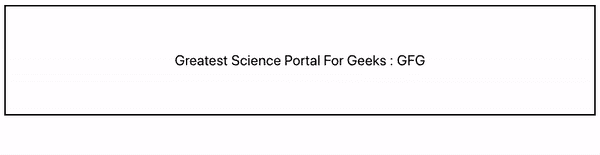

# 重新获取组件更新()方法

> 原文:[https://www . geeksforgeeks . org/reactjs-componentdidupdate-method/](https://www.geeksforgeeks.org/reactjs-componentdidupdate-method/)

componentDidUpdate()方法允许我们在组件更新时执行 React 代码。当传递给组件的道具改变时，所有的网络请求都在这里编码。

componentDidUpdate()是在 componentDidMount()之后调用的，当组件的状态发生变化时，它可以用来执行一些操作。

**语法:**

```
componentDidUpdate(prevProps, prevState, snapshot)
```

参数:以下是此函数中使用的参数:

*   **前一个道具:**传递给组件的前一个道具
*   **前一状态:**组件的前一状态
*   **快照:**getsnapshotbeforupdate()方法返回的值

**提示:**为了避免无限循环，所有网络请求都需要在条件语句中，如下所示:

```
componentDidUpdate(prevProps, prevState) {
  if (prevState.data !== this.state.data) {
    // Now fetch the new data here.
  }
}
```

**创建反应应用程序:**

**步骤 1:** 使用以下命令创建一个反应应用程序:

```
npx create-react-app functiondemo
```

**步骤 2:** 创建项目文件夹(即 functiondemo)后，使用以下命令移动到该文件夹:

```
cd functiondemo
```

**项目结构:**如下图。


项目结构

**示例:**在本例中，我们将构建一个 React 应用程序，当组件的状态更新时，该应用程序会更改标题中的文本。

**App.js:** 现在在 App.js 文件中写下以下代码。在这里，App 是我们编写代码的默认组件。

## java 描述语言

```
import React from 'react';

class App extends React.Component {
  // Defining the state
  state = {
    company: 'GFG'
  };

  componentDidMount() {
    // Changing the state after 600ms
    setTimeout(() => {
      this.setState({ company: 'GeeksForGeeks' });
    }, 600);
  }

  componentDidUpdate() {
    document.getElementById('disclaimer').innerHTML =
      'P.s:  GFG is also known as ' + this.state.company;
  }

  render() {
    return (
      <div>
        <h1 style={{
          margin: 'auto',
          width: '50%',
          padding: 20,
          marginTop: '10%',
          border: 'solid 1px black',
          textAlign: 'center',
          fontSize: 18,
        }}>
          Greatest Science Portal For Geeks :
          {this.state.company}
          <div id="disclaimer"></div>
        </h1>
      </div>
    );
  }
}

export default App;
```

**注意:**可以将自己的造型应用到应用中。

**运行应用程序的步骤:**从项目的根目录使用以下命令运行应用程序:

```
npm start
```

**输出:**



输出