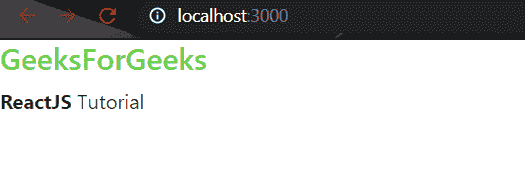
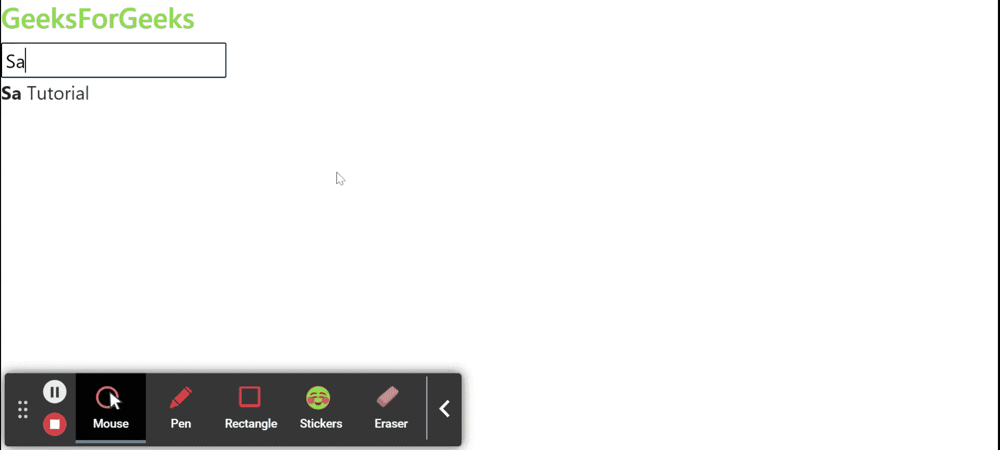

# 重新绑定数据

> 原文:[https://www.geeksforgeeks.org/reactjs-data-binding/](https://www.geeksforgeeks.org/reactjs-data-binding/)

数据绑定是连接视图元素或用户界面以及填充它的数据的过程。

在 **ReactJS** 中，组件被呈现到用户界面，并且组件的逻辑包含要在视图(用户界面)中显示的数据。要在视图中显示的数据和组件逻辑之间的连接在 ReactJS 中称为数据绑定。

**单向数据绑定:** ReactJS 使用单向数据绑定。在单向数据绑定中，可以遵循以下条件之一:

*   **组件到视图:**组件数据的任何变化都会反映在视图中。
*   **组件视图:**视图中的任何更改都会反映在组件的数据中。

为了演示代码示例，我们必须使用以下步骤创建一个基本的 React 应用程序。

**创建反应应用程序:**

*   **步骤 1:** 使用以下命令创建一个反应应用程序:

    ```
    npx create-react-app foldername
    ```

*   **步骤 2:** 创建项目文件夹(即文件夹名**)后，使用以下命令移动到该文件夹中:**

    ```
    cd foldername
    ```

**项目结构:**如下图。


项目结构

### **实现组件查看数据绑定:**

在 **App.js** 文件中写下以下代码。在这里，App 是我们编写代码的默认组件。

## App.js

```
import React, { Component } from 'react';

class App extends Component {

  constructor() {
    super();
    this.state = {
      subject: "ReactJS"
    };
  }

  render() {
    return (
      <div style={{ textAlign: "center" }}>
        <h4 style={{ color: "#68cf48" }}>GeeksForGeeks</h4>
        <p><b>{this.state.subject}</b> Tutorial</p>

      </div>
    )
  }
}

export default App;
```

**运行应用程序的步骤:**从项目的根目录使用以下命令运行应用程序:

```
npm start
```

**输出:**现在打开浏览器，转到***http://localhost:3000/***，会看到如下输出:



启动反应应用程序后的输出

**说明:**组件包含标题、段落和状态变量*主题*。该状态变量的值绑定到标题和段落元素，状态变量(即主题)的任何变化都将反映在视图部分。

### 实现组件数据绑定视图:

我们不能直接将视图应用于 ReactJS 中的组件数据绑定，为此，我们必须向视图元素添加**事件处理程序**。

在 **App.js** 文件中写下以下代码。在这里，App 是我们编写代码的默认组件。

## App.js

```
import React, { Component } from 'react';

class App extends Component {

  constructor() {
    super();
    this.state = {
      subject: ""
    };
  }

  handleChange = event => {
    this.setState({
      subject: event.target.value
    })
  }

  render() {
    return (
      <div>
        <h4 style={{ color: "#68cf48" }}>GeeksForGeeks</h4>
        <input placeholder="Enter Subject" 
        onChange={this.handleChange}></input>
        <p><b>{this.state.subject}</b> Tutorial</p>

      </div>
    )
  }
}

export default App;
```

**运行应用程序的步骤:**从项目的根目录使用以下命令运行应用程序:

```
npm start
```

**输出:**现在打开浏览器，转到***http://localhost:3000/***，会看到如下输出:



**解释**:组件包含标题、段落、输入字段和状态变量*主题*。这里我们使用 onChange 事件，当用户在输入字段中输入值时，变化反映在状态变量*主题中，我们可以在视图中看到变化的值。*