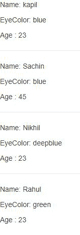

# 试剂 defaultProps

> 哎哎哎:# t0]https://www . geeksforgeeks . org/reacjs-default props/

defaultProps 是一个 React 组件属性，允许您为 Props 参数设置默认值。如果传递了 prop 属性，它将被更改。defaultProps 可以定义为组件类本身的一个属性，为类设置默认的 Props。

### **创建反应应用程序:**

**步骤 1:** 使用以下命令创建一个反应应用程序:

```
npx create-react-app foldername
```

**步骤 2:** 创建项目文件夹(即文件夹名)后，使用以下命令移动到该文件夹:

```
cd foldername
```

**项目结构:**如下图。


**在基于类的组件中创建默认道具:**现在在 **App.js** 文件中写下以下代码。在这里，App 是我们的默认组件，我们使用基于类的组件编写代码。

## App.js

```
import React, { Component } from 'react';

class App extends Component {
  render() {
    return (
      <div >
        <Person name="kapil" eyeColor="blue" age="23"></Person>
        <Person name="Sachin" eyeColor="blue" ></Person>
        <Person name="Nikhil" age="23"></Person>
        <Person eyeColor="green" age="23"></Person>
      </div>
    );
  }
}

class Person extends Component {
  render() {
    return (
      <div>
        <p> Name: {this.props.name} </p>
        <p>EyeColor: {this.props.eyeColor}</p>
        <p>Age : {this.props.age} </p>
      </div>
    )
  }
}

Person.defaultProps = {
  name: "Rahul",
  eyeColor: "deepblue",
  age: "45"
}

export default App;
```

**运行应用程序的步骤:**从项目的根目录使用以下命令运行应用程序:

```
npm start
```

**输出:**现在打开浏览器，转到***http://localhost:3000/***，会看到如下输出:



**在功能组件中创建默认道具:**现在在 **App.js** 文件中写下以下代码。在这里，App 是我们的默认组件，我们使用功能组件编写代码。

## App.js

```
import React from 'react';

function App(props) {
  return (
    <div >
      <Person name="kapil" eyeColor="blue" age="23"></Person>
      <Person name="Sachin" eyeColor="blue" ></Person>
      <Person name="Nikhil" age="23"></Person>
      <Person eyeColor="green" age="23"></Person>
    </div>
  );
}

function Person(props) {
  return (
    <div>
      <p> Name: {props.name} </p>
      <p>EyeColor: {props.eyeColor}</p>
      <p>Age : {props.age} </p>
      <hr></hr>
    </div>
  )
}

Person.defaultProps = {
  name: "Rahul",
  eyeColor: "deepblue",
  age: "45"
}

export default App;
```

**运行应用程序的步骤:**从项目的根目录使用以下命令运行应用程序:

```
npm start
```

**输出:**现在打开浏览器，转到***http://localhost:3000/***，会看到如下输出:

