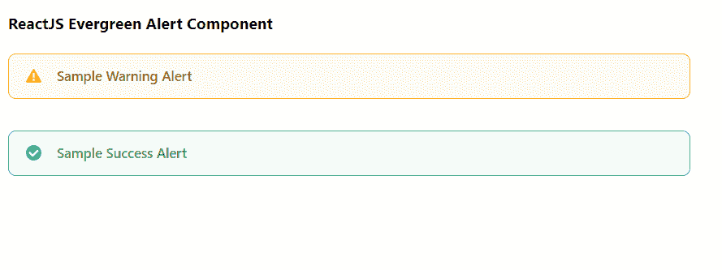

# 重新获取常青警报组件

> 原文:[https://www . geeksforgeeks . org/reactjs-evergreen-alert-component/](https://www.geeksforgeeks.org/reactjs-evergreen-alert-component/)

React Evergreen 是一个受欢迎的前端库，它有一组 React 组件来构建漂亮的产品，因为这个库是灵活的、合理的默认值和用户友好的。报警组件用于紧急中断，要求 确认 ，通知用户情况。我们可以在 ReactJS 中使用以下方法来使用常青树警报组件。

**警戒道具:**

*   **子级:**用于定义预警的内容。
*   **意图:**用于表示警报的意图。
*   **标题:**用于定义预警的标题。
*   **hasIcon:** 如果设置为 true，则用于在左侧显示与类型匹配的图标。
*   **是可移动的:**如果设置为真，用于显示移除图标按钮。
*   **onRemove:** 是点击移除按钮时调用的回调函数。
*   **外观:**用于定义预警的外观。

**内乐道具:**

*   **子级:**用于定义预警的内容。
*   **意图:**用于表示警报的意图。
*   **hasIcon:** 如果设置为 true，则用于在左侧显示与类型匹配的图标。
*   **大小:**用来表示文字的大小。

**创建反应应用程序并安装模块:**

*   **步骤 1:** 使用以下命令创建一个反应应用程序:

    ```
    npx create-react-app foldername
    ```

*   **步骤 2:** 创建项目文件夹(即文件夹名**)后，使用以下命令移动到该文件夹中:**

    ```
    cd foldername
    ```

*   **步骤 3:** 创建 ReactJS 应用程序后，使用以下命令安装所需的****模块:****

    ```
    **npm install evergreen-ui**
    ```

******项目结构:**如下图。****

****

项目结构**** 

******示例:**现在在 **App.js** 文件中写下以下代码。在这里，App 是我们编写代码的默认组件。****

## ****App.js****

```
**import React from 'react'
import { Alert } from 'evergreen-ui'

export default function App() {
  return (
    <div style={{
      display: 'block', width: 700, paddingLeft: 30
    }}>
      <h4>ReactJS Evergreen Alert Component</h4>
      <Alert
        intent="warning"
        title="Sample Warning Alert"
        marginBottom={32}
      />
      <Alert
        intent="success"
        title="Sample Success Alert"
        marginBottom={32}
      />
    </div>
  );
}**
```

******运行应用程序的步骤:**从项目的根目录使用以下命令运行应用程序:****

```
**npm start**
```

******输出:**现在打开浏览器，转到***http://localhost:3000/***，会看到如下输出:****

********

******参考:**T2】https://evergreen.segment.com/components/alert****