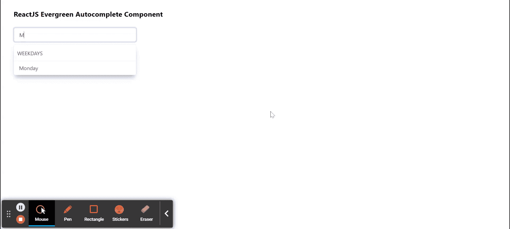

# 重新获取常青树自动完成组件

> 原文:[https://www . geeksforgeeks . org/reactjs-evergreen-autocomplete-component/](https://www.geeksforgeeks.org/reactjs-evergreen-autocomplete-component/)

React Evergreen 是一个受欢迎的前端库，它有一组 React 组件来构建漂亮的产品，因为这个库是灵活的、合理的默认值和用户友好的。自动完成组件用于自动完成带有选项值 的自由文本值。基本上允许用户从选项列表中键入和选择项目。  我们可以在 ReactJS 中使用以下方法来使用长青自动完成组件。

**自动完成道具:**

*   **标题:**用于为项目提供标题。
*   **项目:**用于表示作为选择选项的项目数组。
*   **选择编辑项:**用于表示自动完成时要显示的选定项目。
*   **itemToString:** 它是一个在每个项目上使用的函数，用于在项目数组不是字符串数组的情况下返回将在过滤器上显示的字符串。
*   **子级:**是用来渲染‘滤镜’组件的函数。
*   **itemSize:** 用于表示列表中每个项目的高度。
*   **renderItem:** 它是一个返回组件来渲染项目的函数。
*   **位置:**用于波波头的位置。
*   **项目过滤器:**用于过滤项目的功能。
*   **isFilterDisabled:** 用于启用和禁用过滤。
*   **popoverMinWidth:** 用于表示结果容器的最小高度。
*   **popoverMaxHeight:** 用于表示结果容器的最大高度。
*   **allowthervalues:**用于表示输入是否接受超出提供项目的任意用户输入。

**自动复合命题:**

*   **子元素:**用于传递该组件的子元素。
*   **样式:**用于传递组件的样式。
*   **选择:**表示项目是否被选择。
*   **ishighlight:**用于表示是否高亮显示该项目。

**创建反应应用程序并安装模块:**

*   **步骤 1:** 使用以下命令创建一个反应应用程序:

    ```jsx
    npx create-react-app foldername
    ```

*   **步骤 2:** 在创建项目文件夹(即文件夹名**)后，使用以下命令将**移动到该文件夹:

    ```jsx
    cd foldername
    ```

*   **步骤 3:** 创建 ReactJS 应用程序后，使用以下命令安装所需的模块:

    ```jsx
    npm install evergreen-ui
    ```

**项目结构:**如下图。


项目结构

**示例:**现在在 **App.js** 文件中写下以下代码。在这里，App 是我们编写代码的默认组件。

## App.js

```jsx
import React from 'react'
import { Autocomplete, TextInput } from 'evergreen-ui'

export default function App() {
  return (
    <div style={{
      display: 'block', width: 700, paddingLeft: 30
    }}>
      <h4>ReactJS Evergreen Autocomplete Component</h4>
      <Autocomplete
        title="Weekdays"
        items={['Monday', 'Tuesday', 'Wednesday', 'Thursday', 
                'Friday', 'Saturday', 'Sunday']}
      >
        {props => {
          return (
            <TextInput
              placeholder="Enter Weekday"
              ref={props.getRef}
              value={props.inputValue}
              {... props.getInputProps()}
            />
          )
        }}
      </Autocomplete>
    </div>
  );
}
```

**运行应用程序的步骤:**从项目的根目录使用以下命令运行应用程序:

```jsx
npm start
```

**输出:**现在打开浏览器，转到***http://localhost:3000/***，会看到如下输出:



**参考:**T2】https://evergreen.segment.com/components/autocomplete/props