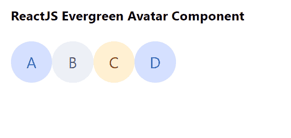

# 重新获得常青树头像组件

> 原文:[https://www . geeksforgeeks . org/reactjs-evergreen-avatar-component/](https://www.geeksforgeeks.org/reactjs-evergreen-avatar-component/)

React Evergreen 是一个受欢迎的前端库，它有一组 React 组件来构建漂亮的产品，因为这个库是灵活的、合理的默认值和用户友好的。头像组件仅用于表示用户。我们可以在 ReactJS 中使用以下方法来使用常青树化身组件。

**头像道具:**

*   **类名:**用于传递该组件的类名。
*   **src:** 用于传递图像元素或头像的图像地址。
*   **大小:**用来表示头像的大小。
*   **名称:**用于表示姓名首字母和头衔属性的名称。
*   **hashValue:** 用于表示哈希函数使用的值。
*   **颜色:**用于表示头像使用的颜色。
*   **getInitials:** 是一个基于名字获取首字母的函数。
*   **强制显示姓名首字母:**设置为真时，用于强制显示姓名首字母。
*   **size limiteone character:**用于当大小小于这个数字时，对头像使用单个首字母。
*   **形状:**用于表示头像组件的形状。它可以是圆形的也可以是方形的。

**创建反应应用程序并安装模块:**

*   **步骤 1:** 使用以下命令创建一个反应应用程序:

    ```jsx
    npx create-react-app foldername
    ```

*   **步骤 2:** 创建项目文件夹(即文件夹名**)后，使用以下命令移动到该文件夹中:**

    ```jsx
    cd foldername
    ```

*   **步骤 3:** 创建 ReactJS 应用程序后，使用以下命令安装所需的模块:

    ```jsx
    npm install evergreen-ui
    ```

**项目结构:**如下图。


项目结构

**示例:**现在在 **App.js** 文件中写下以下代码。在这里，App 是我们编写代码的默认组件。

## App.js

```jsx
import React from 'react'
import { Avatar } from 'evergreen-ui'

export default function App() {
  return (
    <div style={{
      display: 'block', width: 700, paddingLeft: 30
    }}>
      <h4>ReactJS Evergreen Avatar Component</h4>
      <Avatar name="Ajay" size={50} />
      <Avatar name="Bunty" size={50} />
      <Avatar name="Chirag" size={50} />
      <Avatar name="Dinesh" size={50} />
    </div>
  );
}
```

**运行应用程序的步骤:**从项目的根目录使用以下命令运行应用程序:

```jsx
npm start
```

**输出:**现在打开浏览器，转到***http://localhost:3000/***，会看到如下输出:



**参考:**T2】https://evergreen.segment.com/components/avatar