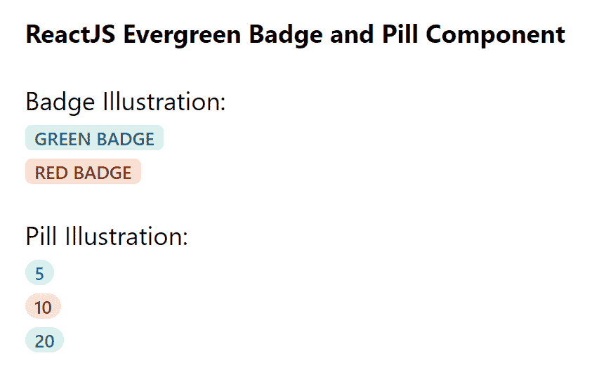

# 重新获得常青徽章和药丸组件

> 原文:[https://www . geeksforgeeks . org/reactjs-evergreen-badge-and-pill-component/](https://www.geeksforgeeks.org/reactjs-evergreen-badge-and-pill-component/)

React Evergreen 是一个受欢迎的前端库，它有一组 React 组件来构建漂亮的产品，因为这个库是灵活的、合理的默认值和用户友好的。徽章和药丸组件是带有背景色的标签。它们用于标记  目的。我们可以在 ReactJS 中使用以下方法来使用常青树徽章和药丸组件。

**徽章道具:**

*   **颜色:**用于表示徽章组件的颜色。
*   **isInteractive:** 用于指示是否应用悬停/聚焦/活动样式。

**药丸道具:**不带任何道具。

**创建反应应用程序并安装模块:**

*   **步骤 1:** 使用以下命令创建一个反应应用程序:

    ```jsx
    npx create-react-app foldername
    ```

*   **步骤 2:** 创建项目文件夹(即文件夹名**)后，使用以下命令移动到该文件夹中:**

    ```jsx
    cd foldername
    ```

*   **步骤 3:** 创建 ReactJS 应用程序后，使用以下命令安装所需的模块:

    ```jsx
    npm install evergreen-ui
    ```

**项目结构:**如下图。


项目结构

**示例:**现在在 **App.js** 文件中写下以下代码。在这里，App 是我们编写代码的默认组件。

## App.js

```jsx
import React from 'react'
import { Badge, Pill } from 'evergreen-ui'

export default function App() {
  return (
    <div style={{
      display: 'block', width: 700, paddingLeft: 30
    }}>
      <h4>ReactJS Evergreen Badge and Pill Component</h4>
      Badge Illustration:  <br></br>
      <Badge color="green">
       Green Badge
      </Badge> 
      <br></br>
      <Badge color="red">
        Red Badge
      </Badge> 
      <br></br> <br></br>

      Pill Illustration: <br></br>
      <Pill color="blue">5</Pill> <br></br>
      <Pill color="yellow">10</Pill> <br></br>
      <Pill color="green">20</Pill>
    </div>
  );
}
```

**运行应用程序的步骤:**从项目的根目录使用以下命令运行应用程序:

```jsx
npm start
```

**输出:**现在打开浏览器，转到***http://localhost:3000/***，会看到如下输出:



**参考:**T2】https://evergreen.segment.com/components/badges