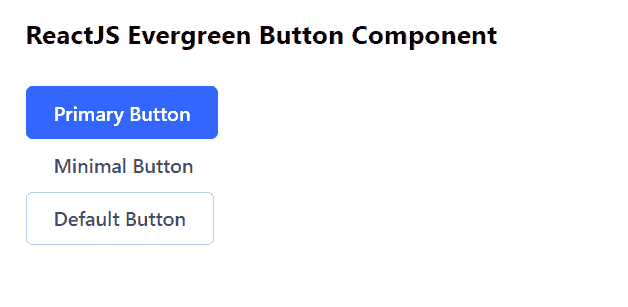

# 反应堆常青按钮组件

> 原文:[https://www . geesforgeks . org/reactjs-evergreen-button-component/](https://www.geeksforgeeks.org/reactjs-evergreen-button-component/)

React Evergreen 是一个受欢迎的前端库，它有一组 React 组件来构建漂亮的产品，因为这个库是灵活的、合理的默认值和用户友好的。按钮组件允许用户通过一次点击来采取行动和做出选择。我们可以在 ReactJS 中使用以下方法来使用常青树按钮组件。

**按钮道具:**

*   **外观:**用于表示按钮的外观。
*   **大小:**用于表示按钮的大小。
*   **加载:**设置为真时，用于在子对象前显示加载微调器。
*   **激活:**用于强制设置按钮的激活状态。
*   **图标前:**用于在文本前设置图标。
*   **图标后:**用于设置文本后的图标。
*   **禁用:**设置为真时，用于禁用按钮。
*   **类名:**用于传递按钮的类名。

图标按钮提议:

*   **大小:**用于表示按钮的大小。
*   **图标:**用于表示自定义图标节点或常青树图标。
*   **图标大小:**用于表示图标大小。
*   **意图:**用于表示按钮的意图。
*   **外观:**用于表示按钮的外观。
*   **激活:**用于强制设置按钮的激活状态。
*   **禁用:**设置为真时，用于禁用按钮。
*   **类名:**用于传递按钮的类名。

**文字下拉按钮提议:**

*   **激活:**用于强制设置按钮的激活状态。
*   **禁用:**设置为真时，用于禁用按钮。
*   **图标:**用于表示自定义图标节点或常青树图标。
*   **类名:**用于传递按钮的类名。

**创建反应应用程序并安装模块:**

*   **步骤 1:** 使用以下命令创建一个反应应用程序:

    ```
    npx create-react-app foldername
    ```

*   **步骤 2:** 在创建项目文件夹(即文件夹名**)后，使用以下命令将**移动到该文件夹:

    ```
    cd foldername
    ```

*   **步骤 3:** 创建 ReactJS 应用程序后，使用以下命令安装所需的模块:

    ```
    npm install evergreen-ui
    ```

**项目结构:**如下图。


项目结构

**示例:**现在在 **App.js** 文件中写下以下代码。在这里，App 是我们编写代码的默认组件。

## App.js

```
import React from 'react'
import { Button } from 'evergreen-ui'

export default function App() {
  return (
    <div style={{
      display: 'block', width: 700, paddingLeft: 30
    }}>
      <h4>ReactJS Evergreen Button Component</h4>
      <Button appearance="primary">
        Primary Button
      </Button>
      <br></br>
      <Button appearance="minimal">
        Minimal Button
      </Button>
      <br></br>
      <Button>Default Button</Button>
    </div>
  );
}
```

**运行应用程序的步骤:**从项目的根目录使用以下命令运行应用程序:

```
npm start
```

**输出:**现在打开浏览器，转到***http://localhost:3000/***，会看到如下输出:



**参考:**T2】https://evergreen.segment.com/components/buttons