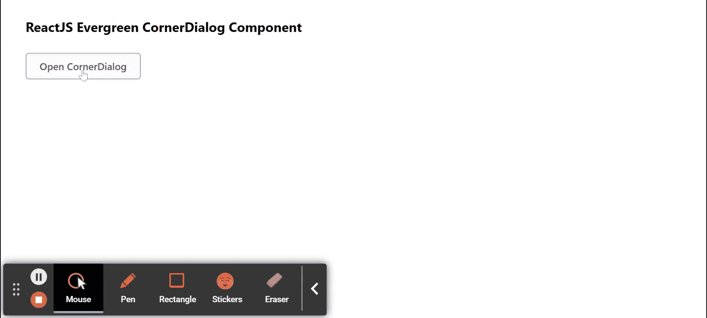

# 重新连接常青树角对话框组件

> 原文:[https://www . geeksforgeeks . org/reactjs-evergreen-corner dialog-component/](https://www.geeksforgeeks.org/reactjs-evergreen-cornerdialog-component/)

React Evergreen 是一个受欢迎的前端库，它有一组 React 组件来构建漂亮的产品，因为这个库是灵活的、合理的默认值和用户友好的。CornerDialog 组件用于发布新功能、反馈请求等。  我们可以在 ReactJS 中使用以下方法来使用长青角对话框组件。

**角膜对话命题:**

*   **子级:**子级可以是字符串、函数或节点。
*   **意图:**用于表示角对话框的意图。
*   **isShown:** 设置为真时显示对话框。
*   **标题:**用于表示对话框的标题。
*   **onCloseComplete:** 这是退出转换完成时会触发的功能。
*   **on pencomplete:**是进入过渡完成时会触发的功能。
*   **有页脚:**设置为真时，用取消确认按钮显示页脚。
*   **onConfirm:** 是点击确认按钮时会触发的功能。
*   **确认标签:**用于表示确认按钮的标签。
*   **hasCancel:** 设置为真时，显示取消按钮。
*   **关闭:**设置为真时显示关闭按钮。
*   **onCancel:** 是点击取消按钮时会调用的函数。
*   **取消标签:**用于表示取消按钮的标签。
*   **宽度:**用于表示对话框的宽度。
*   **container rops:**用于表示传递给对话容器的道具。
*   **位置:**用于设置转角对话框的位置

**创建反应应用程序并安装模块:**

*   **步骤 1:** 使用以下命令创建一个反应应用程序:

    ```
    npx create-react-app foldername
    ```

*   **步骤 2:** 在创建项目文件夹(即文件夹名**)后，使用以下命令将**移动到该文件夹:

    ```
    cd foldername
    ```

*   **步骤 3:** 创建 ReactJS 应用程序后，使用以下命令安装所需的****模块:****

    ```
    **npm install evergreen-ui**
    ```

******项目结构:**如下图。****

****

项目结构**** 

******示例:**现在在 **App.js** 文件中写下以下代码。在这里，App 是我们编写代码的默认组件。****

## ****App.js****

```
**import React from 'react'
import { CornerDialog, Button } from 'evergreen-ui'

export default function App() {

  const [openDialog, setOpenDialog] = React.useState(false)

  return (
    <div style={{
      display: 'block', width: 700, paddingLeft: 30
    }}>
      <h4>ReactJS Evergreen CornerDialog Component</h4>

      <Button onClick={() => setOpenDialog(true)}>
         Open CornerDialog
      </Button>

      <CornerDialog
        isShown={openDialog}
        title="New Feature is live"
        onCloseComplete={() => setOpenDialog(false)}
      >
        Please give your valuable feedback for this new feature
      </CornerDialog>
    </div>
  );
}**
```

******运行应用程序的步骤:**从项目的根目录使用以下命令运行应用程序:****

```
**npm start**
```

******输出:**现在打开浏览器，转到***http://localhost:3000/***，会看到如下输出:****

********

******参考:**T2】https://evergreen.segment.com/components/corner-dialog****