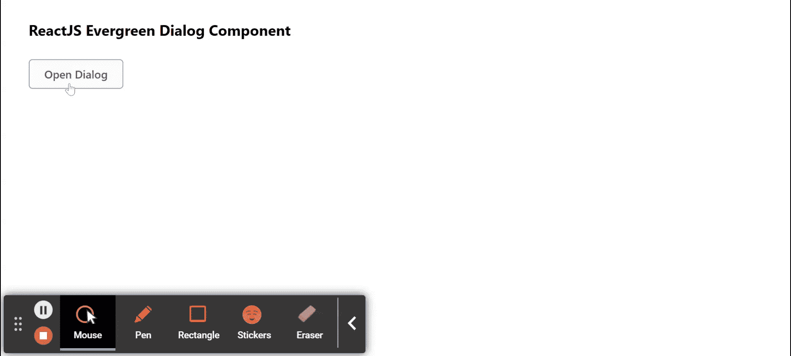

# 重新获取常青树对话框组件

> 原文:[https://www . geeksforgeeks . org/reactjs-evergreen-dialog-component/](https://www.geeksforgeeks.org/reactjs-evergreen-dialog-component/)

React Evergreen 是一个受欢迎的前端库，它有一组 React 组件来构建漂亮的产品，因为这个库是灵活的、合理的默认值和用户友好的。对话组件允许用户在覆盖层上显示内容，这需要用户交互。 我们可以在 ReactJS 中使用以下方法来使用常青树对话框组件。

**对话道具:**

*   **子级:**子级可以是字符串、函数或节点。
*   **意图:**用于表示对话框的意图。
*   **isShown:** 设置为真时显示对话框。
*   **标题:**用于表示对话框的标题。
*   **哈希德:**如果设置为真，将显示带有标题和关闭图标按钮的标题。
*   **表头:**用来用我们自己的自定义组件覆盖默认表头。
*   **有页脚:**设置为真时，用取消确认按钮显示页脚。
*   **页脚:**用来用我们自己的自定义组件覆盖默认页脚。
*   **hasCancel:** 设置为真时，显示取消按钮。
*   **关闭:**设置为真时显示关闭按钮。
*   **onCloseComplete:** 这是退出转换完成时会触发的功能。
*   **on pencomplete:**是进入过渡完成时会触发的功能。
*   **onConfirm:** 是点击确认按钮时会触发的功能。
*   **确认标签:**用于表示确认按钮的标签。
*   **为确认加载:**当设置为真时，确认按钮设置为加载状态。
*   **确认禁用:**当设置为真时，确认按钮设置为禁用状态。
*   **onCancel:** 是点击取消按钮时会触发的功能。
*   **取消标签:**用于表示取消按钮的标签。
*   **shouldenoverlayclick:**用于指示叠加是否应在点击时关闭叠加。
*   **应关闭图标按钮:**用于指示按下 ESC 键是否应关闭覆盖。
*   **宽度:**用于表示对话框的宽度。
*   **拓扑设置:**用于表示对话框上方的空间。
*   **sideOffset:** 当屏幕上没有足够的水平空间可用时，用于表示对话框左/右侧的空间。
*   **minh8 content:**用于表示身体内容物的最小高度。
*   **container rops:**用于表示传递给对话容器的道具。
*   **contentContainerProps:** 用于表示传递给内容容器的道具。
*   **防止滚动:**表示是否防止外体滚动。
*   **叠加道具:**用于表示传递给叠加组件的道具。

**创建反应应用程序并安装模块:**

*   **步骤 1:** 使用以下命令创建一个反应应用程序:

    ```jsx
    npx create-react-app foldername
    ```

*   **步骤 2:** 在创建项目文件夹(即文件夹名**)后，使用以下命令将**移动到该文件夹:

    ```jsx
    cd foldername
    ```

*   **步骤 3:** 创建 ReactJS 应用程序后，使用以下命令安装所需的****模块:****

    ```jsx
    **npm install evergreen-ui**
    ```

******项目结构:**如下图。****

****

项目结构**** 

******示例:**现在在 **App.js** 文件中写下以下代码。在这里，App 是我们编写代码的默认组件。****

## ****App.js****

```jsx
**import React from 'react'
import { Dialog, Button } from 'evergreen-ui'

export default function App() {

  const [openDialog, setOpenDialog] = React.useState(false)

  return (
    <div style={{
      display: 'block', width: 700, paddingLeft: 30
    }}>
      <h4>ReactJS Evergreen Dialog Component</h4>

      <Button onClick={() => setOpenDialog(true)}>
        Open Dialog
      </Button>

      <Dialog
        isShown={openDialog}
        title="Sample Dialog"
        confirmLabel="This is a sample dialog for demo"
        onCloseComplete={() => setOpenDialog(false)}
      >
        Dialog content
      </Dialog>
    </div>
  );
}**
```

******运行应用程序的步骤:**从项目的根目录使用以下命令运行应用程序:****

```jsx
**npm start**
```

******输出:**现在打开浏览器，转到***http://localhost:3000/***，会看到如下输出:****

********

******参考:**T2】https://evergreen.segment.com/components/dialog****