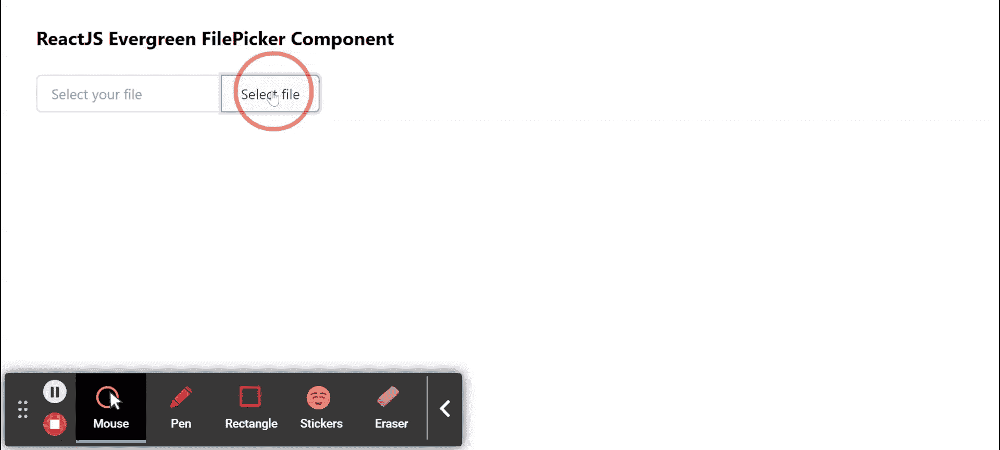

# 重新获取常青文件选择器组件

> 原文:[https://www . geeksforgeeks . org/reactjs-evergreen-file picker-component/](https://www.geeksforgeeks.org/reactjs-evergreen-filepicker-component/)

React Evergreen 是一个受欢迎的前端库，它有一组 React 组件来构建漂亮的产品，因为这个库是灵活的、合理的默认值和用户友好的。文件选择器组件允许用户从文件系统中选择一个或多个文件。  我们可以在 ReactJS 中使用以下方法来使用长青文件选择器组件。

**Filepicker Props:**

*   **名称:**用于表示输入的名称属性。
*   **accept:** 用于表示输入的 accept 属性。
*   **必选:**用于在真时使文件选择器成为必选。
*   **多个:**真时用于接受多个文件。
*   **禁用:**当设置为真时，用于禁用文件选择器。
*   **捕捉:**用于表示输入的捕捉属性。
*   **高度:**用于表示文件拾取器的高度。
*   **onChange:** 是 onChange 被激发时调用的函数。
*   **onbull:**是 onbull 被激发时调用的函数。
*   **占位符:**用于表示文本输入的占位符。
*   **类名:**用于传递文件选择器的类名。

**创建反应应用程序并安装模块:**

*   **步骤 1:** 使用以下命令创建一个反应应用程序:

    ```jsx
    npx create-react-app foldername
    ```

*   **步骤 2:** 创建项目文件夹(即文件夹名**)后，使用以下命令移动到该文件夹中:**

    ```jsx
    cd foldername
    ```

*   **步骤 3:** 创建 ReactJS 应用程序后，使用以下命令安装所需的****模块:****

    ```jsx
    **npm install evergreen-ui**
    ```

******项目结构:**如下图。****

****

项目结构**** 

******示例:**现在在 **App.js** 文件中写下以下代码。在这里，App 是我们编写代码的默认组件。****

## ****App.js****

```jsx
**import React from 'react'
import { FilePicker } from 'evergreen-ui'

export default function App() {

  return (
    <div style={{
      display: 'block', width: 700, paddingLeft: 30
    }}>
      <h4>ReactJS Evergreen FilePicker Component</h4>

      <FilePicker
        width={200}
        placeholder="Select your file"
      />

    </div>
  );
}**
```

******运行应用程序的步骤:**从项目的根目录使用以下命令运行应用程序:****

```jsx
**npm start**
```

******输出:**现在打开浏览器，转到***http://localhost:3000/***，会看到如下输出:****

********

******参考:**T2】https://evergreen.segment.com/components/file-picker****