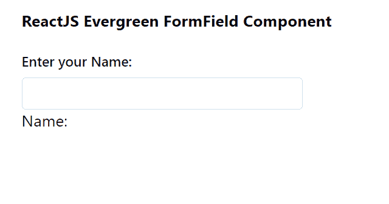

# 反应堆常青模板组件

> 原文:[https://www . geeksforgeeks . org/reactjs-evergreen-formfield-component/](https://www.geeksforgeeks.org/reactjs-evergreen-formfield-component/)

React Evergreen 是一个受欢迎的前端库，它有一组 React 组件来构建漂亮的产品，因为这个库是灵活的、合理的默认值和用户友好的。表单域组件允许用户将其作为一个实用程序组件来帮助组成表单域  我们可以在 ReactJS 中使用以下方法来使用 Evergreen 表单域组件。

**表单域道具:**

*   **标签:**用于表示输入元素上方使用的标签。
*   **标签符:**用于表示标签上作为 htmlFor 道具传递的。
*   **isRequired:** 用于指示标签后是否显示星号。
*   **描述:**定义标签下方和输入元素上方字段的可选描述。
*   **提示:**用于定义输入元素下的可选提示。
*   **验证消息:**用于显示验证消息。

**FormFieldDescription 道具:**不带任何道具。

**FormFieldHint 道具:**不需要任何道具。

**模具弹性模量的建议:**

*   **isAstrixShown:** 用于表示标签后是否显示星号。

**FormFieldValidationMessage 道具:**不需要任何道具。

**创建反应应用程序并安装模块:**

*   **步骤 1:** 使用以下命令创建一个反应应用程序:

    ```jsx
    npx create-react-app foldername
    ```

*   **步骤 2:** 创建项目文件夹(即文件夹名**)后，使用以下命令移动到该文件夹中:**

    ```jsx
    cd foldername
    ```

*   **步骤 3:** 创建 ReactJS 应用程序后，使用以下命令安装所需的****模块:****

    ```jsx
    **npm install evergreen-ui**
    ```

******项目结构:**如下图。****

****

项目结构**** 

******示例:**现在在 **App.js** 文件中写下以下代码。在这里，App 是我们编写代码的默认组件。****

## ****App.js****

```jsx
**import React from 'react'
import { TextInput, FormField } from 'evergreen-ui'

export default function App() {

  // State for Name
  const [name, setName] = React.useState('')

  return (
    <div style={{
      display: 'block', width: 700, paddingLeft: 30
    }}>
      <h4>ReactJS Evergreen FormField Component</h4>
      <FormField label="Enter your Name:">
        <TextInput
          onChange={(e) => setName(e.target.value)}
        /> <br></br>
        Name: {name}
      </FormField>
    </div>
  );
}**
```

******运行应用程序的步骤:**从项目的根目录使用以下命令运行应用程序:****

```jsx
**npm start**
```

******输出:**现在打开浏览器，转到***http://localhost:3000/***，会看到如下输出:****

********

******参考:**T2】https://evergreen.segment.com/components/form-field/props****