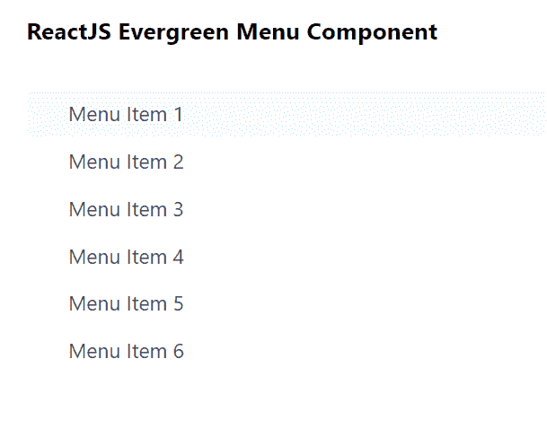

# 重新获取常青树菜单组件

> 原文:[https://www . geeksforgeeks . org/reactjs-evergreen-menu-component/](https://www.geeksforgeeks.org/reactjs-evergreen-menu-component/)

React Evergreen 是一个受欢迎的前端库，它有一组 React 组件来构建漂亮的产品，因为这个库是灵活的、合理的默认值和用户友好的。菜单组件允许用户向显示用户可以采取的动作列表。我们可以在 ReactJS 中使用以下方法来使用常青树菜单组件。

**命题菜单:**

*   **子级:**用于表示菜单组件的子级。

**MenuDivider 道具:**这个不拿任何道具。

**菜单组道具:**

*   **标题:**用于表示菜单组的标题。
*   **儿童:**用于表示菜单组的儿童。

**MenuItem Props:**

*   **是:**用于表示菜单项使用的元素类型。
*   **类名:**用于将类名传递给组件。
*   **onSelect:** 这是一个在点击和回车/空格键时触发的功能。
*   **图标:**用于定义标签前的自定义图标或常青树图标。
*   **children:** 用来表示部件的子部件。
*   **次要文本:**用于表示右侧显示的次要文本。
*   **外观:**默认主题只支持一种默认外观。
*   **意图:**用于表示菜单项的意图。
*   **禁用:**用于指示菜单项是否禁用。

**菜单选项 Props:**

*   **id:** 用于表示菜单选项的 *id* 属性。
*   **onSelect:** 这是一个在点击和回车/空格键时触发的功能。
*   **选择:**用于表示标签前的图标。
*   **children:** 用来表示部件的子部件。
*   **次要文本:**用于表示右侧显示的次要文本。
*   **外观:**默认主题只支持一种默认外观。

**MenuOptionGroup Props:**

*   **标题:**用于表示菜单组的标题。
*   **选中:**用于表示选项组的当前值。
*   **onChange:** 是选择改变时调用的回调函数。
*   **选项:**用于表示组中渲染的选项列表。

**创建反应应用程序并安装模块:**

*   **步骤 1:** 使用以下命令创建一个反应应用程序:

    ```
    npx create-react-app foldername
    ```

*   **步骤 2:** 在创建项目文件夹(即文件夹名**)后，使用以下命令将**移动到该文件夹:

    ```
    cd foldername
    ```

*   **步骤 3:** 创建 ReactJS 应用程序后，使用以下命令安装所需的****模块:****

     ****```
    npm install evergreen-ui
    ```**** 

******项目结构:**如下图。****

****

项目结构**** 

******示例:**现在在 **App.js** 文件中写下以下代码。在这里，App 是我们编写代码的默认组件。****

## ****App.js****

```
**import React from 'react'
import { Menu } from 'evergreen-ui'

export default function App() {

  return (
    <div style={{
      display: 'block', width: 700, paddingLeft: 30
    }}>
      <h4>ReactJS Evergreen Menu Component</h4>
      <Menu>
        <Menu.Group>
          <Menu.Item>Menu Item 1</Menu.Item>
          <Menu.Item>Menu Item 2</Menu.Item>
          <Menu.Item>Menu Item 3</Menu.Item>
          <Menu.Item>Menu Item 4</Menu.Item>
          <Menu.Item>Menu Item 5</Menu.Item>
          <Menu.Item>Menu Item 6</Menu.Item>
        </Menu.Group>
      </Menu>
    </div>
  );
}**
```

******运行应用程序的步骤:**从项目的根目录使用以下命令运行应用程序:****

```
**npm start**
```

******输出:**现在打开浏览器，转到***http://localhost:3000/***，会看到如下输出:****

********

******参考:**T2】https://evergreen.segment.com/components/menu****