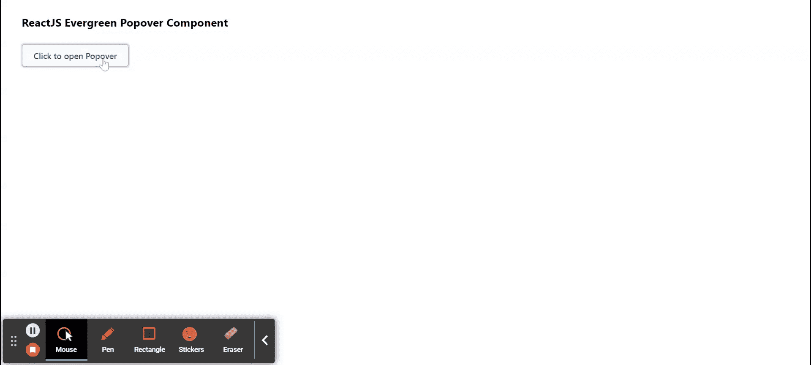

# 重新获得常青波波夫组件

> 原文:[https://www . geesforgeks . org/reactjs-evergreen-Popo ver-component/](https://www.geeksforgeeks.org/reactjs-evergreen-popover-component/)

React Evergreen 是一个受欢迎的前端库，它有一组 React 组件来构建漂亮的产品，因为这个库是灵活的、合理的默认值和用户友好的。弹出组件允许用户显示与目标相关的浮动内容。 我们可以在 ReactJS 中使用以下方法来使用常青树 Popover 组件。

**Popover 道具:**

*   **位置:**用于波波夫的位置。
*   **显示:**如果设置为真，弹出窗口将手动显示。
*   **触发:**用于基于点击或悬停打开 Popover。
*   **含量:**用于表示波波夫的含量。
*   **儿童:**用于表示 Popover 的目标按钮。
*   **显示:**用于传递给 Popover 卡的显示属性。
*   **最小宽度:**用于表示波波夫牌的最小宽度。
*   **明八:**用于表示波波夫牌的最小高度。
*   **状态道具:**用于表示传递给 Popover 卡的属性。
*   **动画持续时间:**用来表示动画的持续时间。
*   **onOpen:** 是 Popover 打开时会触发的功能。
*   **onClose:** 这是一个当 Popover c .失败时将被触发的功能。
*   **onCloseComplete:** 这是退出转换完成时会触发的功能。
*   **on pencomplete:**是进入过渡完成时会触发的功能。
*   **onBodyClick:** 是点击身体时会触发的功能。
*   **布林对焦内侧:**如果设置为真，用于打开 Popover 内侧对焦。
*   **shouldeclonexternalclick:**用于指示如果设置为 true，在对话框外单击应关闭对话框。

**popover 无状态道具:**

*   **子级:**子级可以是字符串、函数或节点。

**创建反应应用程序并安装模块:**

*   **步骤 1:** 使用以下命令创建一个反应应用程序:

    ```
    npx create-react-app foldername
    ```

*   **步骤 2:** 创建项目文件夹(即文件夹名**)后，使用以下命令移动到该文件夹中:**

    ```
    cd foldername
    ```

*   **步骤 3:** 创建 ReactJS 应用程序后，使用以下命令安装所需的****模块:****

    ```
    **npm install evergreen-ui**
    ```

******项目结构:**如下图。****

****

项目结构**** 

******示例:**现在在 **App.js** 文件中写下以下代码。在这里，App 是我们编写代码的默认组件。****

## ****App.js****

```
**import React from 'react'
import { Popover, Pane, Button } from 'evergreen-ui'

export default function App() {

  return (
    <div style={{
      display: 'block', width: 700, paddingLeft: 30
    }}>
      <h4>ReactJS Evergreen Popover Component</h4>
      <Popover
        content={
          <Pane
            width={300}
            height={300}
            display="flex"
            alignItems="center"
            justifyContent="center"
            flexDirection="column"
          >Sample Popover Content
          </Pane>
        }
      >
        <Button>Click to open Popover</Button>
      </Popover>
    </div>
  );
}**
```

******运行应用程序的步骤:**从项目的根目录使用以下命令运行应用程序:****

```
**npm start**
```

******输出:**现在打开浏览器，转到***http://localhost:3000/***，会看到如下输出:****

********

******参考:**T2】https://evergreen.segment.com/components/popover****