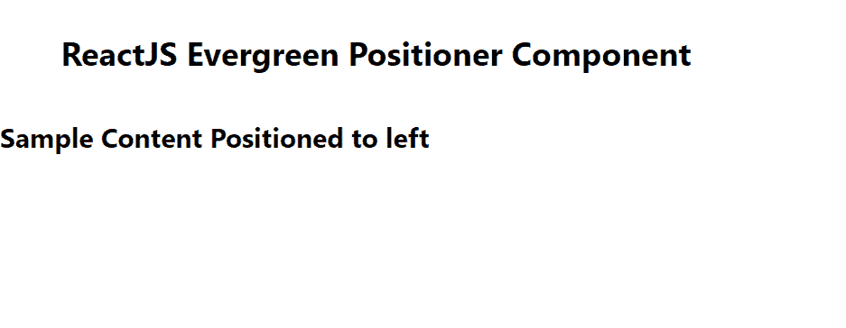

# 反应堆常青定位器组件

> 原文:[https://www . geeksforgeeks . org/reactjs-evergreen-定位器-组件/](https://www.geeksforgeeks.org/reactjs-evergreen-positioner-component/)

React Evergreen 是一个受欢迎的前端库，它有一组 React 组件来构建漂亮的产品，因为这个库是灵活的、合理的默认值和用户友好的。定位器组件允许用户将一个元件定位到一个锚上。它是一个实用组件。我们可以在反应堆中使用以下方法来使用常青定位器组件。

**定位器道具:**

*   **位置:**用于正在定位的元素所在的位置。
*   **isShown:** 用于显示设置为 true 时被定位的元素。
*   **子级:**是用来返回被定位元素的函数。
*   **车身偏移:**表示从车身到被定位元件的最小距离。
*   **目标偏移:**表示从目标到正在定位的元素的最小距离。
*   **目标:**是一个回调函数，应该为目标返回一个节点。
*   **初始刻度:**用于表示被定位元素的初始刻度。
*   **动画持续时间:**用来表示动画的持续时间。
*   **onCloseComplete:** 这是退出转换完成时会触发的功能。
*   **on pencomplete:**是进入过渡完成时会触发的功能。

**创建反应应用程序并安装模块:**

*   **步骤 1:** 使用以下命令创建一个反应应用程序:

    ```
    npx create-react-app foldername
    ```

*   **步骤 2:** 创建项目文件夹(即文件夹名**)后，使用以下命令移动到该文件夹中:**

    ```
    cd foldername
    ```

*   **步骤 3:** 创建 ReactJS 应用程序后，使用以下命令安装所需的****模块:****

    ```
    **npm install evergreen-ui**
    ```

******项目结构:**如下图。****

****

项目结构**** 

******示例:**现在在 **App.js** 文件中写下以下代码。在这里，App 是我们编写代码的默认组件。****

## ****App.js****

```
**import React from 'react'
import { Positioner } from 'evergreen-ui'

export default function App() {

  return (
    <div style={{
      display: 'block', width: 700, paddingLeft: 30
    }}>
      <h4>ReactJS Evergreen Positioner Component</h4>
      <Positioner
        target={() => { console.log("Target Func called!") }}
        children={() => <h5>Sample Content Positioned to left</h5>}
        isShown={true}
        position="left">
      </Positioner>
    </div>
  );
}**
```

******运行应用程序的步骤:**从项目的根目录使用以下命令运行应用程序:****

```
**npm start**
```

******输出:**现在打开浏览器，转到***http://localhost:3000/***，会看到如下输出:****

********

******参考:**T2】https://evergreen.segment.com/components/positioner****