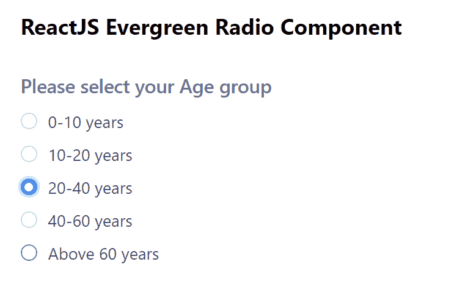

# 反应堆常青无线电组件

> 原文:[https://www . geesforgeks . org/reactjs-evergreen-radio-component/](https://www.geeksforgeeks.org/reactjs-evergreen-radio-component/)

React Evergreen 是一个受欢迎的前端库，它有一组 React 组件来构建漂亮的产品，因为这个库是灵活的、合理的默认值和用户友好的。无线电组件允许用户从一组或一系列项目中选择一个选项。我们可以在 ReactJS 中使用以下方法来使用常青树无线电组件。

**无线电道具:**

*   **id:** 用于表示电台的 *id* 属性。
*   **名称:**用于定义电台的名称属性。
*   **标签:**用于表示收音机的标签。
*   **值:**用于表示电台的价值属性。
*   **onChange:** 是状态改变时调用的回调函数。
*   **禁用:**当设置为真时，收音机禁用。
*   **检查:**当设置为真时，检查收音机。
*   **大小:**用来表示无线电圈的大小。
*   **是必需的:**当设置为真时，收音机获得必需的属性。
*   **无效:**当该属性设置为真时，咏叹调无效属性为真。
*   **外观:**用于复选框的外观。

**RadioGroup 道具:**

*   **选项:**用于传递电台组电台的选项。
*   **值:**用于表示控制时选择的项目值。
*   **默认值:**用于表示无线电组不受控制时的默认值。
*   **onChange:** 是状态改变时调用的回调函数。
*   **标签:**用于表示收音机的标签。
*   **大小:**用来表示无线电圈的大小。
*   **是必需的:**当设置为真时，收音机获得必需的属性。

**创建反应应用程序并安装模块:**

*   **步骤 1:** 使用以下命令创建一个反应应用程序:

    ```jsx
    npx create-react-app foldername
    ```

*   **步骤 2:** 在创建项目文件夹(即文件夹名**)后，使用以下命令将**移动到该文件夹:

    ```jsx
    cd foldername
    ```

*   **步骤 3:** 创建 ReactJS 应用程序后，使用以下命令安装所需的****模块:****

    ```jsx
    **npm install evergreen-ui**
    ```

******项目结构:**如下图。****

****

项目结构**** 

******示例:**现在在 **App.js** 文件中写下以下代码。在这里，App 是我们编写代码的默认组件。****

## ****App.js****

```jsx
**import React from 'react'
import { RadioGroup } from 'evergreen-ui'

export default function App() {

  const [ageGroup, setAgeGroup] = React.useState('0-10 years')

  return (
    <div style={{
      display: 'block', width: 700, paddingLeft: 30
    }}>
      <h4>ReactJS Evergreen Radio Component</h4>
      <RadioGroup
        label="Please select your Age group"
        value={ageGroup}
        options={[
          { label: '0-10 years', value: '0-10 years' },
          { label: '10-20 years', value: '0-10 years' },
          { label: '20-40 years', value: '0-10 years' },
          { label: '40-60 years', value: '40-60 years' },
          { label: 'Above 60 years', value: ' Above 60 years' },
        ]}
        onChange={e => setAgeGroup(e.target.value)}
      />
    </div>
  );
}**
```

******运行应用程序的步骤:**从项目的根目录使用以下命令运行应用程序:****

```jsx
**npm start**
```

******输出:**现在打开浏览器，转到***http://localhost:3000/***，会看到如下输出:****

********

******参考:**T2】https://evergreen.segment.com/components/radio****