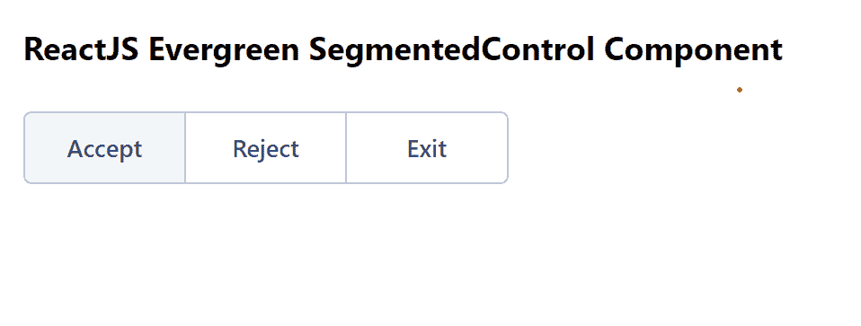

# 重新连接常青分段控制组件

> 原文:[https://www . geeksforgeeks . org/reactjs-evergreen-segmented control-component/](https://www.geeksforgeeks.org/reactjs-evergreen-segmentedcontrol-component/)

React Evergreen 是一个受欢迎的前端库，它有一组 React 组件来构建漂亮的产品，因为这个库是灵活的、合理的默认值和用户友好的。SegmentedControl Component 允许用户在一行中最多四个选项之间切换。我们可以在 ReactJS 中使用以下方法来使用长青分段控制组件。

**分段控制 Props:**

*   **选项:**用于传递分段控制无线电的选项。
*   **值:**用于表示控制时分段控制的当前值。
*   **默认值:**用于表示分段控制不受控时的默认值。
*   **onChange:** 是值变化时调用的函数。
*   **名称:**用于表示电台组的名称。
*   **大小:**用于表示分段控制的大小。
*   **禁用:**当设置为真时，分段控制禁用。

**创建反应应用程序并安装模块:**

*   **步骤 1:** 使用以下命令创建一个反应应用程序:

    ```jsx
    npx create-react-app foldername
    ```

*   **步骤 2:** 创建项目文件夹(即文件夹名**)后，使用以下命令移动到该文件夹中:**

    ```jsx
    cd foldername
    ```

*   **步骤 3:** 创建 ReactJS 应用程序后，使用以下命令安装所需的****模块:****

    ```jsx
    **npm install evergreen-ui**
    ```

******项目结构:**如下图。****

****

项目结构**** 

******示例:**现在在 **App.js** 文件中写下以下代码。在这里，App 是我们编写代码的默认组件。****

## ****App.js****

```jsx
**import React from 'react'
import { SegmentedControl } from 'evergreen-ui'

export default function App() {

  const [value, setValue] = React.useState('Accept')

  return (
    <div style={{
      display: 'block', width: 700, paddingLeft: 30
    }}>
      <h4>ReactJS Evergreen SegmentedControl Component</h4>
      <SegmentedControl 
          width={240} 
          value={value} 
          options={[
            { label: 'Accept', value: 'Accept' },
            { label: 'Reject', value: 'Reject' },
            { label: 'Exit', value: 'Exit' },
          ]} 
          onChange={(data) => setValue(data)} />
    </div>
  );
}**
```

******运行应用程序的步骤:**从项目的根目录使用以下命令运行应用程序:****

```jsx
**npm start**
```

******输出:**现在打开浏览器，转到***http://localhost:3000/***，会看到如下输出:****

********

******参考:**T2】https://evergreen.segment.com/components/segmented-control****