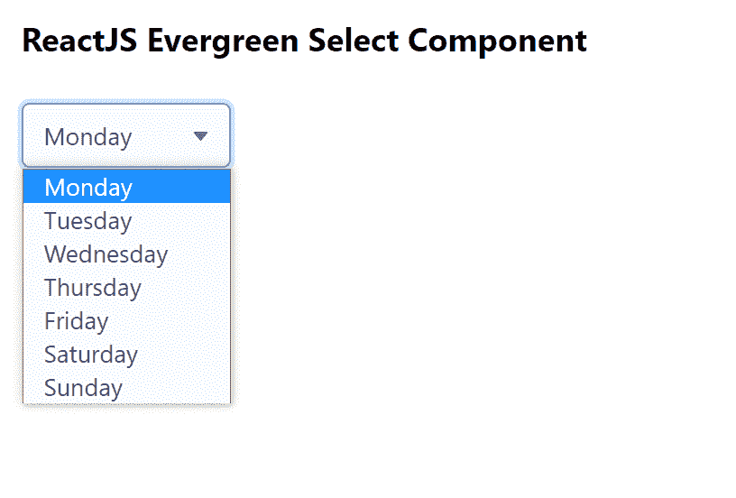

# 重新获得常青树精选组件

> 原文:[https://www . geesforgeks . org/reactjs-evergreen-select-component/](https://www.geeksforgeeks.org/reactjs-evergreen-select-component/)

React Evergreen 是一个受欢迎的前端库，它有一组 React 组件来构建漂亮的产品，因为这个库是灵活的、合理的默认值和用户友好的。选择组件允许用户从选项列表中选择一个项目。我们可以在 ReactJS 中使用以下方法来使用常青树选择组件。

**选择道具:**

*   **id:** 用于表示选择的 *id* 属性。
*   **名称:**用于定义选择的名称属性。
*   **子级:**用于传递传递给 select 的选项。
*   **默认值:**用于表示不受控制的选择的初始值
*   **onChange:** 是值变化时调用的函数。
*   **值:**用于表示选择的值。
*   **必需:**当设置为真时，选择是必需的。
*   **自动对焦:**当设置为真时，选择应自动对焦。
*   **无效:**当设置为真时，选择无效。
*   **外观:**用于选择的外观。

**选场命题:**

*   **标签:**用于表示输入元素上方使用的标签。
*   **标签符:**用于表示标签上作为 htmlFor 道具传递的。
*   **必选:**用于表示标签后是否显示星号。
*   **描述:**定义标签下方和输入元素上方字段的可选描述。
*   **提示:**用于定义输入元素下的可选提示。
*   **验证消息:**用于显示验证消息。
*   **输入高度:**用于表示输入元素的高度。
*   **输入宽度:**用于表示输入宽度的宽度。

**创建反应应用程序并安装模块:**

*   **步骤 1:** 使用以下命令创建一个反应应用程序:

    ```jsx
    npx create-react-app foldername
    ```

*   **步骤 2:** 在创建项目文件夹(即文件夹名**)后，使用以下命令将**移动到该文件夹:

    ```jsx
    cd foldername
    ```

*   **步骤 3:** 创建 ReactJS 应用程序后，使用以下命令安装所需的****模块:****

    ```jsx
    **npm install evergreen-ui**
    ```

******项目结构:**如下图。****

****

项目结构**** 

******示例:**现在在 **App.js** 文件中写下以下代码。在这里，App 是我们编写代码的默认组件。****

## ****App.js****

```jsx
**import React from 'react'
import { Select } from 'evergreen-ui'

export default function App() {

  return (
    <div style={{
      display: 'block', width: 700, paddingLeft: 30
    }}>
      <h4>ReactJS Evergreen Select Component</h4>
      <Select>
        <option value="Monday" selected>Monday</option>
        <option value="Tuesday" >Tuesday</option>
        <option value="Wednesday" >Wednesday</option>
        <option value="Thursday" >Thursday</option>
        <option value="Friday" >Friday</option>
        <option value="Saturday" >Saturday</option>
        <option value="Sunday" >Sunday</option>
      </Select>
    </div>
  );
}**
```

******运行应用程序的步骤:**从项目的根目录使用以下命令运行应用程序:****

```jsx
**npm start**
```

******输出:**现在打开浏览器，转到***http://localhost:3000/***，会看到如下输出:****

********

******参考:**T2】https://evergreen.segment.com/components/select****