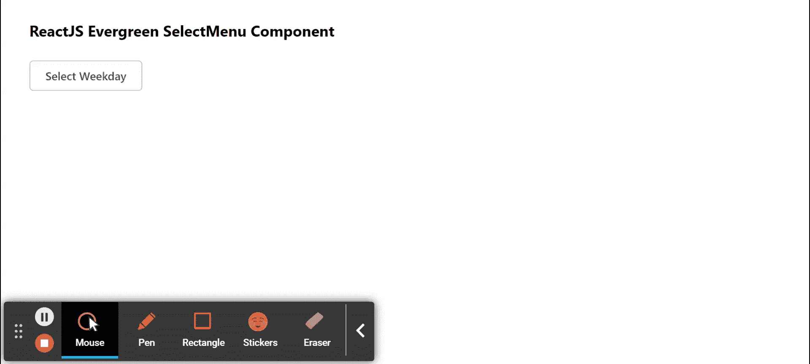

# 重新获取常青树选择菜单组件

> 原文:[https://www . geesforgeks . org/reactjs-evergreen-select menu-component/](https://www.geeksforgeeks.org/reactjs-evergreen-selectmenu-component/)

React Evergreen 是一个受欢迎的前端库，它有一组 React 组件来构建漂亮的产品，因为这个库是灵活的、合理的默认值和用户友好的。选择菜单组件允许用户从下拉列表中选择多个项目。我们可以在 ReactJS 中使用以下方法来使用常青树选择菜单组件。

**选项道具:**

*   **children:** 用于将 children 元素传递给这个组件。
*   **禁用:**用于指示选项是否禁用。
*   **高度:**用于表示高度。
*   **ishighlight:**用于表示是否高亮显示某个项目。
*   **是可选择的:**用于表示一个项目是否可选择。
*   **被选中:**用于表示一个项目是否被选中。
*   **项目:**用于表示我们选择菜单的项目。
*   **onSelect:** 是选择一个选项时触发的功能。
*   **on select:**是取消选择某个选项时触发的功能。
*   **样式:**用于构件造型。

**期权清单命题:**

*   **选项:**用于表示菜单中要显示的选项。
*   **关闭:**是组件关闭时触发的功能。
*   **宽度:**用于表示选择菜单的宽度。
*   **高度:**用于表示选择菜单的高度。
*   **是多选:**多选在设置为真时被考虑。
*   **关闭选择:**当选项选择设置为真时，菜单关闭。
*   **选定:**用于表示选定的值。
*   **onSelect:** 是选择一个选项时触发的功能。
*   **on select:**是取消选择某个选项时触发的功能。
*   **onFilterChange:** 是为过滤器的 *onChange* 事件触发的功能。
*   **hasFilter:** 设置为 true 时显示过滤器。
*   **选项大小:**用于表示选项大小。
*   **renderItem:** 是一个可以用来渲染项目的函数。
*   **过滤器占位符:**用于表示搜索过滤器的占位符。
*   **过滤器图标:**用于表示搜索过滤器的图标。
*   **选项过滤器:**是用于过滤选项的功能。
*   **默认搜索值:**用于表示默认搜索值。

**精选菜单命题:**

*   **标题:**用于表示选择菜单的标题。
*   **宽度:**用于表示选择菜单的宽度。
*   **高度:**用于表示选择菜单的高度。
*   **选项:**用于表示菜单中要显示的选项。
*   **onSelect:** 是选择一个选项时触发的功能。
*   **on select:**是取消选择某个选项时触发的功能。
*   **选定:**用于表示选定的值。
*   **是多选:**多选在设置为真时被考虑。
*   **hasTitle:** 设置为真时显示标题。
*   **hasFilter:** 设置为 true 时显示过滤器。
*   **过滤器占位符:**用于表示搜索过滤器的占位符。
*   **过滤器图标:**用于表示搜索过滤器的图标。
*   **onFilterChange:** 是为过滤器的 *onChange* 事件触发的功能。
*   **位置:**用于选择菜单的位置。
*   **detailView:** 它是一个功能或节点，在选择菜单的右侧呈现，在选择一个选项时给出附加信息。
*   **标题视图:**在选择菜单的标题部分呈现的功能或节点，用于自定义标题。
*   **emptyView:** 是在没有选项时，代替选项列表进行渲染的函数或节点。
*   **关闭选择:**用于指示选择时是否关闭组件。
*   **项目渲染器:**这是一个可以在选择菜单中渲染自定义项目的功能。
*   **项目高度:**用于表示选择菜单列表中项目的高度。

**选择性菜单内容命题:**

*   **关闭:**是组件关闭时触发的功能。
*   **标题:**用于表示选择菜单的标题。
*   **宽度:**用于表示选择菜单的宽度。
*   **高度:**用于表示选择菜单的高度。
*   **表头:用于表示表头的高度。**
*   **选项:**用于表示菜单中要显示的选项。
*   **hasTitle:** 设置为真时显示标题。
*   **hasFilter:** 设置为 true 时显示过滤器。
*   **过滤器占位符:**用于表示搜索过滤器的占位符。
*   **过滤器图标:**用于表示搜索过滤器的图标。
*   **列表道具:**用来表示传递给这个组件的道具列表。
*   **是多选:**多选在设置为真时被考虑。
*   **关闭选择:**当选项选择设置为真时，菜单关闭。
*   **标题视图:**用于表示放置在标题部分的节点。
*   **详细视图:**用于表示放置在选项旁边的节点。
*   **空视图:**用于表示没有选项时显示的节点，而不是选项列表。

**创建反应应用程序并安装模块:**

*   **步骤 1:** 使用以下命令创建一个反应应用程序:

    ```
    npx create-react-app foldername
    ```

*   **步骤 2:** 创建项目文件夹(即文件夹名**)后，使用以下命令移动到该文件夹中:**

    ```
    cd foldername
    ```

*   **步骤 3:** 创建 ReactJS 应用程序后，使用以下命令安装所需的****模块:****

    ```
    **npm install evergreen-ui**
    ```

******项目结构:**如下图。****

****

项目结构**** 

******示例:**现在在 **App.js** 文件中写下以下代码。在这里，App 是我们编写代码的默认组件。****

## ****App.js****

```
**import React from 'react'
import { SelectMenu, Button } from 'evergreen-ui'

export default function App() {

  // State for selected 
  const [selected, setSelected] = React.useState(null)

  // Sample Options
  const options = [
    { label: 'Monday', value: 'Monday' },
    { label: 'Tuesday', value: 'Tuesday' },
    { label: 'Wednesday', value: 'Wednesday' },
    { label: 'Thursday', value: 'Thursday' },
    { label: 'Friday', value: 'Friday' },
    { label: 'Saturday', value: 'Saturday' },
    { label: 'Sunday', value: 'Sunday' },
  ]

  return (
    <div style={{
      display: 'block', width: 700, paddingLeft: 30
    }}>
      <h4>ReactJS Evergreen SelectMenu Component</h4>
      <SelectMenu
        selected={selected}
        options={options}
        title="Select week day"
        onSelect={(item) => setSelected(item.value)}
      ><Button> {selected || `Select Weekday`}</Button>
      </SelectMenu>
    </div>
  );
}**
```

******运行应用程序的步骤:**从项目的根目录使用以下命令运行应用程序:****

```
**npm start**
```

******输出:**现在打开浏览器，转到***http://localhost:3000/***，会看到如下输出:****

********

******参考:**T2】https://evergreen.segment.com/components/select-menu****