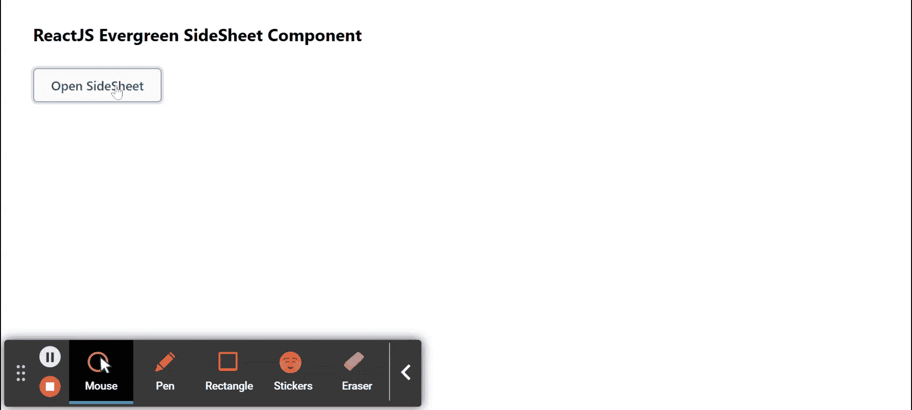

# 反应常青侧片组件

> 原文:[https://www . geesforgeks . org/reactjs-evergreen-sidesheet-component/](https://www.geeksforgeeks.org/reactjs-evergreen-sidesheet-component/)

React Evergreen 是一个受欢迎的前端库，它有一组 React 组件来构建漂亮的产品，因为这个库是灵活的、合理的默认值和用户友好的。侧页组件允许用户显示关于对象的更多细节。 我们可以在 ReactJS 中使用以下方法来使用常青树侧页组件。

sheet close props:t1]

*   **isClosing:** 用于表示该组件的关闭行为。
*   **位置:**用于部件的位置。

**侧页道具:**

*   **子级:**子级可以是字符串、函数或节点。
*   **isShown:** 当设置为真时，用于显示侧页。
*   **onCloseComplete:** 这是退出转换完成时会触发的功能。
*   **on pencomplete:**是进入过渡完成时会触发的功能。
*   **onBeforeClose:** 是覆盖即将关闭时调用的函数。
*   **shouldenoverlayclick:**用于指示叠加是否应在点击时关闭叠加。
*   **应关闭图标按钮:**用于指示按下 ESC 键是否应关闭覆盖。
*   **宽度:**用于定义侧页的宽度。
*   **容器属性:**用于定义通过侧页容器窗格的属性。
*   **位置:**用于定位板材。
*   **防止滚动:**表示是否防止外体滚动。

**创建反应应用程序并安装模块:**

*   **步骤 1:** 使用以下命令创建一个反应应用程序:

    ```jsx
    npx create-react-app foldername
    ```

*   **步骤 2:** 在创建项目文件夹(即文件夹名**)后，使用以下命令将**移动到该文件夹:

    ```jsx
    cd foldername
    ```

*   **步骤 3:** 创建 ReactJS 应用程序后，使用以下命令安装所需的****模块:****

    ```jsx
    **npm install evergreen-ui**
    ```

******项目结构:**如下图。****

****

项目结构**** 

******示例:**现在在 **App.js** 文件中写下以下代码。在这里，App 是我们编写代码的默认组件。****

## ****App.js****

```jsx
**import React from 'react'
import { SideSheet, Button } from 'evergreen-ui'

export default function App() {

  const [sideSheetOpenStatus, setSideSheetOpenStatus] = React.useState(false)

  return (
    <div style={{
      display: 'block', width: 700, paddingLeft: 30
    }}>
      <h4>ReactJS Evergreen SideSheet Component</h4>
      <React.Fragment>
        <SideSheet
          isShown={sideSheetOpenStatus}
          onCloseComplete={() => setSideSheetOpenStatus(false)}
        ><h4>Sample Text for this Component!</h4>
        </SideSheet>
        <Button
          onClick={() => setSideSheetOpenStatus(true)}
        >Open SideSheet</Button>
      </React.Fragment>
    </div>
  );
}**
```

******运行应用程序的步骤:**从项目的根目录使用以下命令运行应用程序:****

```jsx
**npm start**
```

******输出:**现在打开浏览器，转到***http://localhost:3000/***，会看到如下输出:****

********

******参考:**T2】https://evergreen.segment.com/components/side-sheet****